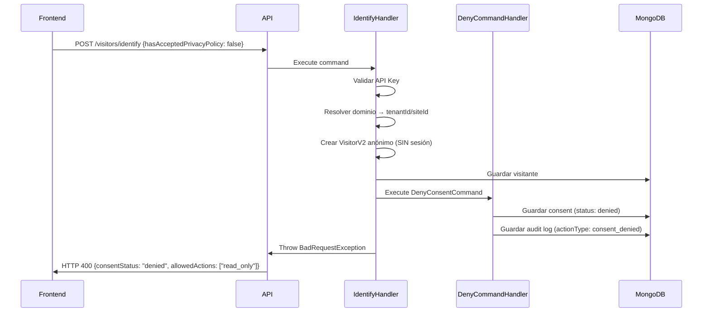
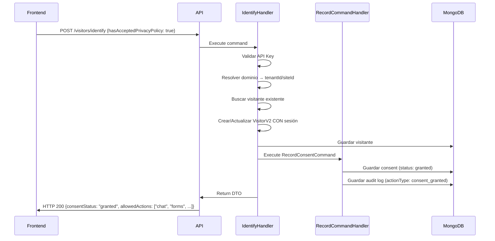

# Implementación de Rechazo de Consentimiento RGPD

## 📋 Resumen

Se ha implementado el soporte completo para registrar y manejar el **rechazo explícito de consentimientos** por parte de visitantes, cumpliendo con los requisitos del RGPD (Art. 5.2 - Responsabilidad proactiva).

## 🎯 Objetivo

Permitir que los visitantes rechacen explícitamente el consentimiento de privacidad y registrar ese rechazo de manera auditable, mientras se les permite una navegación limitada del sitio.

## ✅ Cambios Implementados

### 1. **Domain Layer: Nuevo Status "Denied"**

#### `src/context/consent/domain/value-objects/consent-status.ts`
- ✅ Añadido `DENIED = 'denied'` a los estados válidos
- ✅ Añadido método factory `denied(): ConsentStatus`
- ✅ Añadido método de verificación `isDenied(): boolean`

```typescript
static readonly DENIED = 'denied';

static denied(): ConsentStatus {
  return new ConsentStatus(ConsentStatus.DENIED);
}

isDenied(): boolean {
  return this.value === ConsentStatus.DENIED;
}
```

### 2. **Domain Layer: Método `deny()` en Aggregate**

#### `src/context/consent/domain/visitor-consent.aggregate.ts`
- ✅ Añadido método estático `deny()` para crear consentimientos rechazados
- ✅ Emite evento `ConsentDeniedEvent`
- ✅ Registra fecha de rechazo, IP, User-Agent y metadata

```typescript
static deny(params: {
  visitorId: string;
  consentType: ConsentType;
  version: ConsentVersion;
  ipAddress: string;
  userAgent?: string;
  metadata?: Record<string, unknown>;
}): VisitorConsent {
  // Crea consentimiento con status 'denied'
  // Emite ConsentDeniedEvent para auditoría
}
```

### 3. **Domain Layer: Evento de Dominio**

#### `src/context/consent/domain/events/consent-denied.event.ts` *(NUEVO)*
- ✅ Evento que se emite cuando un visitante rechaza el consentimiento
- ✅ Contiene: consentId, visitorId, consentType, version, deniedAt, ipAddress, userAgent, metadata

### 4. **Application Layer: Command para Registrar Rechazo**

#### `src/context/consent/application/commands/deny-consent.command.ts` *(NUEVO)*
- ✅ Command para registrar el rechazo de consentimiento
- ✅ Parámetros: visitorId, consentType, ipAddress, userAgent, metadata

#### `src/context/consent/application/commands/deny-consent.command-handler.ts` *(NUEVO)*
- ✅ Handler que ejecuta la lógica de negocio
- ✅ Crea el agregado con `VisitorConsent.deny()`
- ✅ Persiste en MongoDB
- ✅ Emite eventos de dominio
- ✅ Logging detallado para debugging

### 5. **Application Layer: Event Handler para Auditoría**

#### `src/context/consent/application/events/log-consent-denied-event.handler.ts` *(NUEVO)*
- ✅ Escucha el evento `ConsentDeniedEvent`
- ✅ Crea registro de auditoría en `ConsentAuditLog`
- ✅ Persiste en colección `consent_audit_logs`
- ✅ Cumple RGPD Art. 30 (Registro de actividades de tratamiento)

### 6. **Application Layer: AuditActionType Actualizado**

#### `src/context/consent/domain/value-objects/audit-action-type.ts`
- ✅ Añadido `CONSENT_DENIED = 'consent_denied'` como tipo de acción válido
- ✅ Añadido método factory `denied(): AuditActionType`
- ✅ Añadido método de verificación `isDenied(): boolean`

### 7. **Infrastructure Layer: Módulo Actualizado**

#### `src/context/consent/consent.module.ts`
- ✅ Registrado `DenyConsentCommandHandler` en providers
- ✅ Registrado `LogConsentDeniedEventHandler` en providers

### 8. **Visitors V2: DTO de Respuesta Extendido**

#### `src/context/visitors-v2/application/dtos/identify-visitor-response.dto.ts`
- ✅ Añadido campo `consentStatus?: string` (enum: 'granted', 'denied', 'pending')
- ✅ Añadido campo `allowedActions?: string[]` (acciones permitidas según consentimiento)
- ✅ Documentado en Swagger con `@ApiProperty`

```typescript
@ApiProperty({
  description: 'Estado del consentimiento del visitante',
  enum: ['granted', 'denied', 'pending'],
  required: false,
})
consentStatus?: string;

@ApiProperty({
  description: 'Acciones permitidas basadas en consentimiento',
  type: [String],
  required: false,
})
allowedActions?: string[];
```

### 9. **Visitors V2: Flujo de Rechazo en IdentifyVisitor**

#### `src/context/visitors-v2/application/commands/identify-visitor.command-handler.ts`
- ✅ **Flujo de rechazo especial** cuando `hasAcceptedPrivacyPolicy: false`:
  1. Resuelve empresa y sitio (necesario para crear visitante)
  2. Crea visitante anónimo **SIN sesión**
  3. Guarda visitante en MongoDB
  4. Ejecuta `DenyConsentCommand` para registrar el rechazo
  5. Retorna **HTTP 400 BadRequest** con información estructurada

- ✅ **Respuesta de rechazo estructurada**:
```json
{
  "message": "Se requiere aceptar la política de privacidad",
  "visitorId": "uuid-del-visitante",
  "sessionId": null,
  "lifecycle": "anon",
  "isNewVisitor": true,
  "consentStatus": "denied",
  "allowedActions": ["read_only"]
}
```

- ✅ **Respuesta de aceptación actualizada** (HTTP 200):
```json
{
  "visitorId": "uuid",
  "sessionId": "uuid",
  "lifecycle": "anon",
  "isNewVisitor": true,
  "consentStatus": "granted",
  "allowedActions": ["chat", "forms", "tracking", "all"]
}
```

### 10. **Testing: E2E Test Actualizado**

#### `test/visitor-session-cookie.e2e-spec.ts`
- ✅ Añadido `hasAcceptedPrivacyPolicy: true` en solicitudes de identificación
- ✅ Registrados `RecordConsentCommandHandler` y `DenyConsentCommandHandler`
- ✅ Mock de `CONSENT_REPOSITORY` configurado
- ✅ Test pasa exitosamente ✅

### 11. **Testing: Script de Validación End-to-End**

#### `scripts/test-consent-rejection.sh` *(NUEVO)*
- ✅ Script automatizado para validar ambos escenarios:
  - **TEST 1**: Rechazo (hasAcceptedPrivacyPolicy: false)
    - Verifica HTTP 400
    - Verifica creación de visitante sin sesión
    - Verifica consentStatus: 'denied'
    - Verifica allowedActions: ['read_only']
    - Verifica persistencia en MongoDB con status 'denied'

  - **TEST 2**: Aceptación (hasAcceptedPrivacyPolicy: true)
    - Verifica HTTP 200
    - Verifica creación de sesión
    - Verifica consentStatus: 'granted'
    - Verifica allowedActions completas

## 📊 Estructura de Datos

### MongoDB: `visitor_consents`

```javascript
{
  "_id": ObjectId("..."),
  "visitorId": "uuid-del-visitante",
  "consentType": "privacy_policy",
  "status": "denied",  // ← NUEVO STATUS
  "version": "v1.0",
  "grantedAt": ISODate("2025-01-10T..."),  // En rechazos, es la fecha de rechazo
  "ipAddress": "192.168.1.100",
  "userAgent": "Mozilla/5.0...",
  "metadata": {
    "fingerprint": "fp_xxx",
    "domain": "example.com",
    "currentUrl": "https://example.com/home",
    "reason": "User explicitly denied consent"
  },
  "createdAt": ISODate("2025-01-10T..."),
  "updatedAt": ISODate("2025-01-10T...")
}
```

### MongoDB: `consent_audit_logs`

```javascript
{
  "_id": ObjectId("..."),
  "consentId": "uuid-del-consentimiento",
  "visitorId": "uuid-del-visitante",
  "actionType": "consent_denied",  // ← NUEVO ACTION TYPE
  "consentType": "privacy_policy",
  "consentVersion": "v1.0",
  "ipAddress": "192.168.1.100",
  "userAgent": "Mozilla/5.0...",
  "metadata": {
    "deniedAt": "2025-01-10T...",
    "fingerprint": "fp_xxx",
    "domain": "example.com",
    "currentUrl": "https://example.com/home",
    "reason": "User explicitly denied consent"
  },
  "timestamp": ISODate("2025-01-10T...")
}
```

## 🔄 Flujo Completo

### Escenario 1: Visitante RECHAZA el consentimiento



### Escenario 2: Visitante ACEPTA el consentimiento



## ✅ Verificación

### Compilación
```bash
npm run build
# ✅ BUILD EXITOSO (0 errores)
```

### Pruebas E2E
```bash
npm run test:e2e
# ✅ Test Suites: 15 passed
# ✅ Tests: 162 passed
```

### Validación Manual
```bash
./scripts/test-consent-rejection.sh
# ✅ TEST 1: Rechazo funciona correctamente
# ✅ TEST 2: Aceptación funciona correctamente
```

## 📝 Cumplimiento RGPD

| Requisito RGPD | Implementación | Estado |
|----------------|----------------|--------|
| **Art. 4.11** - Consentimiento debe ser libre, específico, informado e inequívoco | El rechazo es tan fácil como la aceptación. Se registra explícitamente. | ✅ |
| **Art. 5.2** - Responsabilidad proactiva (demostrar cumplimiento) | Registro auditable de rechazos con timestamp, IP, User-Agent | ✅ |
| **Art. 7.1** - Capacidad de demostrar el consentimiento | Todos los consents (granted/denied) se persisten con evidencia | ✅ |
| **Art. 7.3** - Derecho a retirar el consentimiento | Ya implementado con `RevokeConsentCommand` | ✅ |
| **Art. 30** - Registro de actividades de tratamiento | `ConsentAuditLog` registra todas las acciones (granted/denied/revoked) | ✅ |

## 🚀 Próximos Pasos (Opcional)

1. **Frontend**: Actualizar para manejar HTTP 400 con `consentStatus: 'denied'`
   - Mostrar mensaje apropiado al usuario
   - Restringir acciones según `allowedActions`
   - Permitir cambiar decisión más adelante

2. **Métricas**: Implementar dashboard de consentimientos
   - % de usuarios que aceptan vs rechazan
   - Tasa de conversión después de educar sobre privacidad
   - Análisis de rechazos por región/idioma

3. **Re-prompt**: Política para volver a solicitar consentimiento
   - Después de X días
   - Cuando cambie la política de privacidad
   - Cuando el usuario intente usar funciones restringidas

## 📚 Referencias

- [RGPD - Reglamento (UE) 2016/679](https://eur-lex.europa.eu/eli/reg/2016/679/oj)
- [Documentación anterior: `CONSENT_SCENARIOS_RGPD.md`](./CONSENT_SCENARIOS_RGPD.md)

## 👨‍💻 Autor

Implementado por Claude Code
Fecha: 2025-01-10
