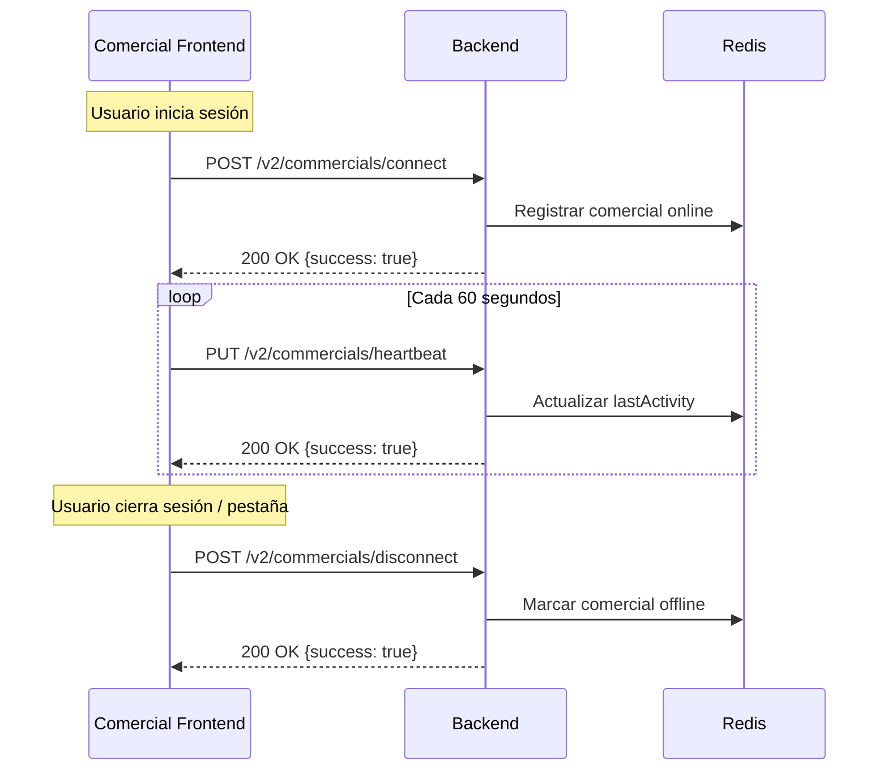

# Guía de Integración - Frontend Comercial

Esta guía explica cómo el frontend del comercial debe integrarse con el backend para informar su disponibilidad y gestionar su presencia en tiempo real.

## Tabla de Contenidos

1. [Flujo de Conexión](#flujo-de-conexión)
2. [Endpoints Disponibles](#endpoints-disponibles)
3. [Implementación Paso a Paso](#implementación-paso-a-paso)
4. [Estados de Conexión](#estados-de-conexión)
5. [Manejo de Errores](#manejo-de-errores)
6. [Ejemplos de Código](#ejemplos-de-código)

---

## Flujo de Conexión



---

## Endpoints Disponibles

### 1. Conectar Comercial

**Endpoint:** `POST /v2/commercials/connect`
**Autenticación:** Bearer Token (JWT)
**Descripción:** Registra al comercial como conectado y disponible para atender chats.

**Request Body:**
```json
{
  "id": "e7f8a9b0-1234-5678-9abc-def012345678",
  "name": "Juan Pérez",
  "metadata": {
    "browser": "Chrome",
    "version": "120.0",
    "timezone": "America/Mexico_City"
  }
}
```

**Response (200 OK):**
```json
{
  "success": true,
  "message": "Comercial conectado exitosamente",
  "commercial": {
    "id": "e7f8a9b0-1234-5678-9abc-def012345678",
    "name": "Juan Pérez",
    "connectionStatus": "CONNECTED",
    "lastActivity": "2025-01-15T10:30:00.000Z",
    "isActive": true
  }
}
```

---

### 2. Enviar Heartbeat

**Endpoint:** `PUT /v2/commercials/heartbeat`
**Autenticación:** Bearer Token (JWT)
**Descripción:** Mantiene activa la sesión del comercial. **CRÍTICO:** Debe enviarse cada 60 segundos.

**Request Body:**
```json
{
  "id": "e7f8a9b0-1234-5678-9abc-def012345678",
  "lastActivity": "2025-01-15T10:31:00.000Z",
  "metadata": {
    "action": "viewing_dashboard",
    "activeChats": 3
  }
}
```

**Response (200 OK):**
```json
{
  "success": true,
  "message": "Actividad actualizada exitosamente",
  "commercial": {
    "id": "e7f8a9b0-1234-5678-9abc-def012345678",
    "name": "Juan Pérez",
    "connectionStatus": "CONNECTED",
    "lastActivity": "2025-01-15T10:31:00.000Z",
    "isActive": true
  }
}
```

---

### 3. Desconectar Comercial

**Endpoint:** `POST /v2/commercials/disconnect`
**Autenticación:** Bearer Token (JWT)
**Descripción:** Marca al comercial como desconectado y no disponible.

**Request Body:**
```json
{
  "id": "e7f8a9b0-1234-5678-9abc-def012345678"
}
```

**Response (200 OK):**
```json
{
  "success": true,
  "message": "Comercial desconectado exitosamente"
}
```

---

### 4. Consultar Estado de Conexión

**Endpoint:** `GET /v2/commercials/:id/status`
**Autenticación:** Bearer Token (JWT)
**Descripción:** Obtiene el estado actual de conexión de un comercial.

**Response (200 OK):**
```json
{
  "commercialId": "e7f8a9b0-1234-5678-9abc-def012345678",
  "connectionStatus": "CONNECTED",
  "lastActivity": "2025-01-15T10:30:00.000Z",
  "isActive": true
}
```

---

## Implementación Paso a Paso

### Paso 1: Conectar al Iniciar Sesión

Cuando el comercial inicia sesión y accede al dashboard:

```typescript
// services/commercialPresence.service.ts

class CommercialPresenceService {
  private heartbeatInterval: NodeJS.Timeout | null = null;
  private commercialId: string;
  private baseUrl: string;
  private authToken: string;

  constructor(commercialId: string, baseUrl: string, authToken: string) {
    this.commercialId = commercialId;
    this.baseUrl = baseUrl;
    this.authToken = authToken;
  }

  async connect(name: string): Promise<void> {
    try {
      const response = await fetch(`${this.baseUrl}/v2/commercials/connect`, {
        method: 'POST',
        headers: {
          'Content-Type': 'application/json',
          'Authorization': `Bearer ${this.authToken}`
        },
        body: JSON.stringify({
          id: this.commercialId,
          name: name,
          metadata: {
            browser: navigator.userAgent,
            timezone: Intl.DateTimeFormat().resolvedOptions().timeZone
          }
        })
      });

      if (!response.ok) {
        throw new Error('Error al conectar comercial');
      }

      const data = await response.json();
      console.log('✅ Comercial conectado:', data);

      // Iniciar heartbeat automático
      this.startHeartbeat();
    } catch (error) {
      console.error('❌ Error al conectar:', error);
      throw error;
    }
  }
}
```

---

### Paso 2: Mantener Conexión con Heartbeat

El heartbeat debe enviarse **cada 60 segundos** para mantener al comercial como "activo":

```typescript
class CommercialPresenceService {
  // ... constructor y connect ...

  private startHeartbeat(): void {
    // Limpiar heartbeat anterior si existe
    if (this.heartbeatInterval) {
      clearInterval(this.heartbeatInterval);
    }

    // Enviar heartbeat cada 60 segundos
    this.heartbeatInterval = setInterval(async () => {
      try {
        await this.sendHeartbeat();
      } catch (error) {
        console.error('❌ Error en heartbeat:', error);
        // Reintentar conexión si falla
        this.reconnect();
      }
    }, 60000); // 60 segundos

    console.log('💓 Heartbeat iniciado (cada 60s)');
  }

  private async sendHeartbeat(): Promise<void> {
    const response = await fetch(`${this.baseUrl}/v2/commercials/heartbeat`, {
      method: 'PUT',
      headers: {
        'Content-Type': 'application/json',
        'Authorization': `Bearer ${this.authToken}`
      },
      body: JSON.stringify({
        id: this.commercialId,
        lastActivity: new Date().toISOString()
      })
    });

    if (!response.ok) {
      throw new Error('Error en heartbeat');
    }

    console.log('💓 Heartbeat enviado correctamente');
  }

  private stopHeartbeat(): void {
    if (this.heartbeatInterval) {
      clearInterval(this.heartbeatInterval);
      this.heartbeatInterval = null;
      console.log('💔 Heartbeat detenido');
    }
  }
}
```

---

### Paso 3: Desconectar al Cerrar Sesión

Cuando el comercial cierra sesión o cierra la pestaña:

```typescript
class CommercialPresenceService {
  // ... métodos anteriores ...

  async disconnect(): Promise<void> {
    try {
      // Detener heartbeat
      this.stopHeartbeat();

      // Notificar al backend
      const response = await fetch(`${this.baseUrl}/v2/commercials/disconnect`, {
        method: 'POST',
        headers: {
          'Content-Type': 'application/json',
          'Authorization': `Bearer ${this.authToken}`
        },
        body: JSON.stringify({
          id: this.commercialId
        })
      });

      if (!response.ok) {
        throw new Error('Error al desconectar comercial');
      }

      console.log('👋 Comercial desconectado correctamente');
    } catch (error) {
      console.error('❌ Error al desconectar:', error);
      // No lanzar error porque estamos cerrando sesión de todas formas
    }
  }

  // Reconexión automática en caso de error
  private async reconnect(): Promise<void> {
    console.warn('🔄 Intentando reconectar...');
    this.stopHeartbeat();

    try {
      // Reintentar conexión después de 5 segundos
      await new Promise(resolve => setTimeout(resolve, 5000));
      await this.connect(this.commercialId); // Necesitarás guardar el nombre
    } catch (error) {
      console.error('❌ Error en reconexión:', error);
    }
  }
}
```

---

### Paso 4: Manejo de Ciclo de Vida de la Aplicación

#### En React/Next.js:

```typescript
// hooks/useCommercialPresence.ts
import { useEffect, useRef } from 'react';

export function useCommercialPresence(commercialId: string, name: string) {
  const presenceService = useRef<CommercialPresenceService | null>(null);

  useEffect(() => {
    // Inicializar servicio de presencia
    const authToken = localStorage.getItem('authToken');
    presenceService.current = new CommercialPresenceService(
      commercialId,
      process.env.NEXT_PUBLIC_API_URL!,
      authToken!
    );

    // Conectar al montar
    presenceService.current.connect(name);

    // Manejar cierre de pestaña/navegador
    const handleBeforeUnload = () => {
      // Usar sendBeacon para garantizar que se envíe incluso al cerrar
      navigator.sendBeacon(
        `${process.env.NEXT_PUBLIC_API_URL}/v2/commercials/disconnect`,
        JSON.stringify({ id: commercialId })
      );
    };

    window.addEventListener('beforeunload', handleBeforeUnload);

    // Cleanup al desmontar
    return () => {
      window.removeEventListener('beforeunload', handleBeforeUnload);
      presenceService.current?.disconnect();
    };
  }, [commercialId, name]);

  return presenceService.current;
}
```

#### Uso en componente:

```typescript
// pages/dashboard.tsx
export default function CommercialDashboard() {
  const { user } = useAuth();
  const presence = useCommercialPresence(user.id, user.name);

  return (
    <div>
      <h1>Dashboard Comercial</h1>
      {/* Tu contenido aquí */}
    </div>
  );
}
```

---

## Estados de Conexión

### Estados Posibles

| Estado | Descripción | Visible para visitantes |
|--------|-------------|------------------------|
| `online` | Comercial conectado y disponible | ✅ Sí |
| `busy` | Comercial conectado pero ocupado | ❌ No |
| `offline` | Comercial desconectado | ❌ No |

### Cambiar Estado de Conexión

```typescript
// Cambiar a busy cuando está atendiendo muchos chats
async function setBusyStatus(commercialId: string): Promise<void> {
  await fetch(`${baseUrl}/v2/commercials/status`, {
    method: 'PUT',
    headers: {
      'Content-Type': 'application/json',
      'Authorization': `Bearer ${authToken}`
    },
    body: JSON.stringify({
      id: commercialId,
      status: 'busy'
    })
  });
}
```

---

## Manejo de Errores

### Errores Comunes

#### 1. Token Expirado (401)

```typescript
if (response.status === 401) {
  console.error('❌ Token expirado, redirigiendo a login');
  // Redirigir a página de login
  window.location.href = '/login';
}
```

#### 2. Pérdida de Conexión a Internet

```typescript
window.addEventListener('online', async () => {
  console.log('🌐 Conexión restaurada, reconectando...');
  await presenceService.reconnect();
});

window.addEventListener('offline', () => {
  console.warn('📡 Conexión perdida, intentando reconectar cuando vuelva...');
});
```

#### 3. Backend No Disponible (500)

```typescript
if (response.status >= 500) {
  console.error('❌ Error del servidor, reintentando en 30s...');
  setTimeout(() => presenceService.reconnect(), 30000);
}
```

---

## Ejemplos de Código

### Implementación Completa en TypeScript

```typescript
// services/commercialPresence.service.ts

interface CommercialMetadata {
  browser?: string;
  timezone?: string;
  activeChats?: number;
}

export class CommercialPresenceService {
  private heartbeatInterval: NodeJS.Timeout | null = null;
  private commercialId: string;
  private commercialName: string;
  private baseUrl: string;
  private authToken: string;
  private isConnected: boolean = false;

  constructor(
    commercialId: string,
    commercialName: string,
    baseUrl: string,
    authToken: string
  ) {
    this.commercialId = commercialId;
    this.commercialName = commercialName;
    this.baseUrl = baseUrl;
    this.authToken = authToken;
  }

  async connect(): Promise<void> {
    if (this.isConnected) {
      console.warn('⚠️ Comercial ya está conectado');
      return;
    }

    try {
      const response = await fetch(`${this.baseUrl}/v2/commercials/connect`, {
        method: 'POST',
        headers: {
          'Content-Type': 'application/json',
          'Authorization': `Bearer ${this.authToken}`
        },
        body: JSON.stringify({
          id: this.commercialId,
          name: this.commercialName,
          metadata: {
            browser: navigator.userAgent,
            timezone: Intl.DateTimeFormat().resolvedOptions().timeZone
          }
        })
      });

      if (!response.ok) {
        throw new Error(`HTTP ${response.status}: ${await response.text()}`);
      }

      this.isConnected = true;
      this.startHeartbeat();
      console.log('✅ Comercial conectado correctamente');
    } catch (error) {
      console.error('❌ Error al conectar:', error);
      throw error;
    }
  }

  async disconnect(): Promise<void> {
    if (!this.isConnected) {
      return;
    }

    this.stopHeartbeat();

    try {
      const response = await fetch(`${this.baseUrl}/v2/commercials/disconnect`, {
        method: 'POST',
        headers: {
          'Content-Type': 'application/json',
          'Authorization': `Bearer ${this.authToken}`
        },
        body: JSON.stringify({
          id: this.commercialId
        })
      });

      if (!response.ok) {
        console.warn('⚠️ Error al desconectar, pero continuando...');
      }

      this.isConnected = false;
      console.log('👋 Comercial desconectado');
    } catch (error) {
      console.error('❌ Error al desconectar:', error);
      // No lanzar error porque de todas formas estamos desconectando
    }
  }

  private startHeartbeat(): void {
    this.stopHeartbeat();

    this.heartbeatInterval = setInterval(async () => {
      try {
        await this.sendHeartbeat();
      } catch (error) {
        console.error('❌ Error en heartbeat:', error);
        await this.handleHeartbeatError();
      }
    }, 60000); // 60 segundos

    console.log('💓 Heartbeat iniciado');
  }

  private stopHeartbeat(): void {
    if (this.heartbeatInterval) {
      clearInterval(this.heartbeatInterval);
      this.heartbeatInterval = null;
      console.log('💔 Heartbeat detenido');
    }
  }

  private async sendHeartbeat(): Promise<void> {
    const response = await fetch(`${this.baseUrl}/v2/commercials/heartbeat`, {
      method: 'PUT',
      headers: {
        'Content-Type': 'application/json',
        'Authorization': `Bearer ${this.authToken}`
      },
      body: JSON.stringify({
        id: this.commercialId,
        lastActivity: new Date().toISOString()
      })
    });

    if (!response.ok) {
      throw new Error(`Heartbeat failed: HTTP ${response.status}`);
    }
  }

  private async handleHeartbeatError(): Promise<void> {
    console.warn('🔄 Intentando reconectar...');
    this.stopHeartbeat();
    this.isConnected = false;

    // Esperar 5 segundos antes de reintentar
    await new Promise(resolve => setTimeout(resolve, 5000));

    try {
      await this.connect();
    } catch (error) {
      console.error('❌ Reconexión fallida:', error);
    }
  }
}
```

---

## Checklist de Implementación

- [ ] Conectar comercial al iniciar sesión
- [ ] Enviar heartbeat cada 60 segundos
- [ ] Desconectar al cerrar sesión
- [ ] Manejar cierre de pestaña con `beforeunload`
- [ ] Implementar reconexión automática
- [ ] Manejar pérdida de conexión a internet
- [ ] Manejar tokens expirados
- [ ] Agregar logging para debugging
- [ ] Implementar retry logic con backoff exponencial
- [ ] Testear en diferentes navegadores

---

## Preguntas Frecuentes

### ¿Qué pasa si el comercial cierra la pestaña sin desconectarse?

El backend tiene un timeout de 5 minutos. Si no recibe heartbeat, marca al comercial como offline automáticamente.

### ¿Puedo cambiar el intervalo de heartbeat?

Sí, pero se recomienda **60 segundos** como máximo. Si usas intervalos mayores, el comercial puede aparecer como offline temporalmente.

### ¿Necesito WebSocket para esto?

No. El sistema de heartbeat REST es suficiente para gestionar presencia. WebSocket se usa para notificaciones en tiempo real (mensajes de chat), no para presencia.

---

## Soporte

Si tienes dudas o problemas, revisa:
- Logs del navegador (Consola de Desarrollador)
- Network tab para ver requests/responses
- Estado de conexión con `GET /v2/commercials/:id/status`
