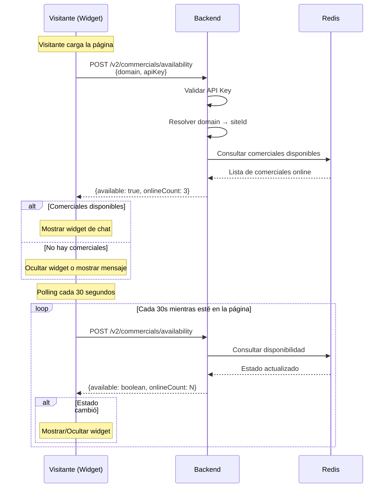

# Guía de Integración - Frontend Visitante

Esta guía explica cómo el frontend del visitante (widget de chat en el sitio web) debe consultar la disponibilidad de comerciales antes de mostrar el chat.

## Tabla de Contenidos

1. [Flujo de Disponibilidad](#flujo-de-disponibilidad)
2. [Endpoint de Disponibilidad](#endpoint-de-disponibilidad)
3. [Implementación Paso a Paso](#implementación-paso-a-paso)
4. [Estrategias de Polling](#estrategias-de-polling)
5. [Integración con WebSocket](#integración-con-websocket)
6. [Ejemplos de Código](#ejemplos-de-código)

---

## Flujo de Disponibilidad



---

## Endpoint de Disponibilidad

### Consultar Disponibilidad

**Endpoint:** `POST /v2/commercials/availability`
**Autenticación:** Ninguna (endpoint público)
**Descripción:** Consulta si hay comerciales disponibles para atender en el sitio.

**Request Body:**
```json
{
  "domain": "landing.mytech.com",
  "apiKey": "ak_live_1234567890abcdef"
}
```

**Campos:**
- `domain` (string, requerido): Dominio del sitio web donde se consulta
- `apiKey` (string, requerido): API Key del sitio para validación

**Response (200 OK):**
```json
{
  "available": true,
  "onlineCount": 3,
  "timestamp": "2025-01-15T10:30:00.000Z",
  "siteId": "site_1234567890"
}
```

**Campos de respuesta:**
- `available` (boolean): `true` si hay comerciales disponibles, `false` si no
- `onlineCount` (number): Número de comerciales online y disponibles
- `timestamp` (string): Timestamp de cuando se generó la respuesta
- `siteId` (string): ID del sitio resuelto (para debugging)

---

### Códigos de Respuesta

| Código | Descripción | Acción Frontend |
|--------|-------------|-----------------|
| 200 | Consulta exitosa | Usar el campo `available` para mostrar/ocultar chat |
| 400 | Datos inválidos (domain o apiKey faltante) | Verificar configuración del widget |
| 401 | API Key inválida para el dominio | Verificar API Key en configuración |
| 404 | Dominio no encontrado | Contactar soporte |
| 500 | Error del servidor | Reintentar después de 30s |

---

## Implementación Paso a Paso

### Paso 1: Configuración Inicial del Widget

Primero, el widget debe tener la configuración del sitio:

```typescript
// widgetConfig.ts
interface WidgetConfig {
  domain: string;      // Dominio del sitio
  apiKey: string;      // API Key del sitio
  apiBaseUrl: string;  // URL del backend
}

// Configuración (usualmente inyectada en el script del widget)
const config: WidgetConfig = {
  domain: window.location.hostname,
  apiKey: 'ak_live_1234567890abcdef', // Desde configuración
  apiBaseUrl: 'https://api.guiders.com'
};
```

---

### Paso 2: Consultar Disponibilidad al Cargar la Página

```typescript
// services/commercialAvailability.service.ts

interface AvailabilityResponse {
  available: boolean;
  onlineCount: number;
  timestamp: string;
  siteId: string;
}

class CommercialAvailabilityService {
  private config: WidgetConfig;
  private pollingInterval: NodeJS.Timeout | null = null;
  private onAvailabilityChange: ((available: boolean) => void) | null = null;
  private lastAvailability: boolean = false;

  constructor(config: WidgetConfig) {
    this.config = config;
  }

  async checkAvailability(): Promise<AvailabilityResponse> {
    try {
      const response = await fetch(`${this.config.apiBaseUrl}/v2/commercials/availability`, {
        method: 'POST',
        headers: {
          'Content-Type': 'application/json'
        },
        body: JSON.stringify({
          domain: this.config.domain,
          apiKey: this.config.apiKey
        })
      });

      if (!response.ok) {
        throw new Error(`HTTP ${response.status}: ${await response.text()}`);
      }

      const data: AvailabilityResponse = await response.json();
      console.log('📊 Disponibilidad:', data);

      // Notificar si cambió el estado
      if (data.available !== this.lastAvailability) {
        this.lastAvailability = data.available;
        this.onAvailabilityChange?.(data.available);
      }

      return data;
    } catch (error) {
      console.error('❌ Error al consultar disponibilidad:', error);
      throw error;
    }
  }

  // Registrar callback para cambios de disponibilidad
  onAvailabilityChanged(callback: (available: boolean) => void): void {
    this.onAvailabilityChange = callback;
  }
}
```

---

### Paso 3: Mostrar/Ocultar Widget según Disponibilidad

```typescript
// components/ChatWidget.tsx

class ChatWidget {
  private availabilityService: CommercialAvailabilityService;
  private widgetElement: HTMLElement;

  constructor(config: WidgetConfig) {
    this.availabilityService = new CommercialAvailabilityService(config);
    this.widgetElement = document.getElementById('chat-widget')!;

    this.init();
  }

  private async init(): Promise<void> {
    try {
      // Consultar disponibilidad inicial
      const availability = await this.availabilityService.checkAvailability();

      // Mostrar u ocultar widget
      this.updateWidgetVisibility(availability.available);

      // Mostrar contador de comerciales disponibles (opcional)
      if (availability.available) {
        this.showAvailabilityBadge(availability.onlineCount);
      }
    } catch (error) {
      console.error('Error al inicializar widget:', error);
      // Ocultar widget si hay error
      this.hideWidget();
    }
  }

  private updateWidgetVisibility(available: boolean): void {
    if (available) {
      this.showWidget();
    } else {
      this.hideWidget();
    }
  }

  private showWidget(): void {
    this.widgetElement.style.display = 'block';
    this.widgetElement.classList.add('chat-widget-visible');
    console.log('✅ Widget de chat visible');
  }

  private hideWidget(): void {
    this.widgetElement.style.display = 'none';
    this.widgetElement.classList.remove('chat-widget-visible');
    console.log('❌ Widget de chat oculto');
  }

  private showAvailabilityBadge(onlineCount: number): void {
    const badge = document.querySelector('.chat-widget-badge');
    if (badge) {
      badge.textContent = `${onlineCount} disponible${onlineCount > 1 ? 's' : ''}`;
      badge.classList.add('visible');
    }
  }
}
```

---

### Paso 4: Polling Inteligente

Implementa polling para mantener actualizada la disponibilidad:

```typescript
class CommercialAvailabilityService {
  // ... métodos anteriores ...

  startPolling(intervalSeconds: number = 30): void {
    // Detener polling anterior si existe
    this.stopPolling();

    // Consultar inmediatamente
    this.checkAvailability();

    // Configurar polling
    this.pollingInterval = setInterval(async () => {
      try {
        await this.checkAvailability();
      } catch (error) {
        console.error('❌ Error en polling:', error);
        // Continuar con el polling incluso si hay error
      }
    }, intervalSeconds * 1000);

    console.log(`⏰ Polling iniciado (cada ${intervalSeconds}s)`);
  }

  stopPolling(): void {
    if (this.pollingInterval) {
      clearInterval(this.pollingInterval);
      this.pollingInterval = null;
      console.log('⏹️ Polling detenido');
    }
  }
}
```

---

## Estrategias de Polling

### 1. Polling Estándar (Recomendado)

Consulta la disponibilidad cada 30 segundos mientras el usuario está en la página:

```typescript
const availabilityService = new CommercialAvailabilityService(config);

// Iniciar polling al cargar
availabilityService.startPolling(30); // cada 30 segundos

// Detener polling al cerrar/cambiar de página
window.addEventListener('beforeunload', () => {
  availabilityService.stopPolling();
});
```

**Ventajas:**
- Simple de implementar
- Bajo impacto en el servidor
- Funciona sin WebSocket

**Desventajas:**
- Delay de hasta 30s para detectar cambios
- Tráfico constante al backend

---

### 2. Polling Adaptativo

Ajusta la frecuencia según el estado:

```typescript
class AdaptivePollingService {
  private currentInterval: number = 30000; // 30s por defecto
  private pollingTimer: NodeJS.Timeout | null = null;

  private scheduleNextPoll(): void {
    this.pollingTimer = setTimeout(async () => {
      const availability = await this.checkAvailability();

      // Si no hay comerciales, aumentar intervalo a 60s
      if (!availability.available) {
        this.currentInterval = 60000;
      } else {
        // Si hay comerciales, mantener en 30s
        this.currentInterval = 30000;
      }

      this.scheduleNextPoll();
    }, this.currentInterval);
  }

  start(): void {
    this.scheduleNextPoll();
  }

  stop(): void {
    if (this.pollingTimer) {
      clearTimeout(this.pollingTimer);
      this.pollingTimer = null;
    }
  }
}
```

---

### 3. Polling con Backoff

Reduce la frecuencia si hay errores consecutivos:

```typescript
class BackoffPollingService {
  private errorCount: number = 0;
  private baseInterval: number = 30000; // 30s

  private getInterval(): number {
    // Exponential backoff: 30s, 60s, 120s, max 300s (5min)
    const interval = Math.min(
      this.baseInterval * Math.pow(2, this.errorCount),
      300000
    );
    return interval;
  }

  private async poll(): Promise<void> {
    try {
      await this.checkAvailability();
      this.errorCount = 0; // Reset en caso de éxito
    } catch (error) {
      this.errorCount++;
      console.warn(`⚠️ Error #${this.errorCount} en polling`);
    } finally {
      // Programar siguiente consulta
      setTimeout(() => this.poll(), this.getInterval());
    }
  }
}
```

---

### 4. Polling con Visibilidad de Página

Pausa el polling cuando la página no está visible:

```typescript
class VisibilityAwarePollingService {
  private pollingInterval: NodeJS.Timeout | null = null;
  private isPageVisible: boolean = !document.hidden;

  constructor(config: WidgetConfig) {
    // ... setup ...
    this.setupVisibilityListener();
  }

  private setupVisibilityListener(): void {
    document.addEventListener('visibilitychange', () => {
      this.isPageVisible = !document.hidden;

      if (this.isPageVisible) {
        console.log('👁️ Página visible, reanudando polling');
        this.startPolling();
      } else {
        console.log('👁️‍🗨️ Página oculta, pausando polling');
        this.stopPolling();
      }
    });
  }

  // ... resto de métodos ...
}
```

---

## Integración con WebSocket (Opcional - Futuro)

Para actualizaciones en tiempo real sin polling:

```typescript
// services/realtimeAvailability.service.ts

class RealtimeAvailabilityService {
  private socket: WebSocket | null = null;

  connect(siteId: string): void {
    this.socket = new WebSocket(`wss://api.guiders.com/socket.io/`);

    this.socket.addEventListener('open', () => {
      console.log('🔌 WebSocket conectado');

      // Suscribirse a cambios de disponibilidad
      this.socket?.send(JSON.stringify({
        event: 'commercial:subscribe-availability',
        data: { siteId }
      }));
    });

    this.socket.addEventListener('message', (event) => {
      const data = JSON.parse(event.data);

      if (data.event === 'commercial:availability-changed') {
        console.log('📡 Disponibilidad cambió:', data.payload);
        this.onAvailabilityChange?.(data.payload.available);
      }
    });

    this.socket.addEventListener('error', (error) => {
      console.error('❌ Error en WebSocket:', error);
    });

    this.socket.addEventListener('close', () => {
      console.log('🔌 WebSocket desconectado');
      // Reconectar después de 5s
      setTimeout(() => this.connect(siteId), 5000);
    });
  }

  disconnect(): void {
    this.socket?.close();
    this.socket = null;
  }
}
```

---

## Ejemplos de Código

### Implementación Completa del Widget

```typescript
// chatWidget.ts

interface WidgetConfig {
  domain: string;
  apiKey: string;
  apiBaseUrl: string;
  pollingInterval?: number; // segundos, default: 30
  showBadge?: boolean;      // mostrar contador de comerciales
}

class ChatWidget {
  private config: WidgetConfig;
  private availabilityService: CommercialAvailabilityService;
  private isVisible: boolean = false;
  private container: HTMLElement;

  constructor(config: WidgetConfig) {
    this.config = {
      pollingInterval: 30,
      showBadge: true,
      ...config
    };

    this.availabilityService = new CommercialAvailabilityService(this.config);
    this.container = this.createWidgetContainer();

    this.init();
  }

  private async init(): Promise<void> {
    // Registrar callback para cambios
    this.availabilityService.onAvailabilityChanged((available) => {
      this.updateVisibility(available);
    });

    // Consultar disponibilidad inicial
    try {
      const availability = await this.availabilityService.checkAvailability();
      this.updateVisibility(availability.available);

      if (this.config.showBadge && availability.available) {
        this.updateBadge(availability.onlineCount);
      }

      // Iniciar polling
      this.availabilityService.startPolling(this.config.pollingInterval!);
    } catch (error) {
      console.error('Error al inicializar widget:', error);
      this.updateVisibility(false);
    }

    // Cleanup al cerrar página
    window.addEventListener('beforeunload', () => {
      this.destroy();
    });

    // Pausar polling cuando página no está visible
    document.addEventListener('visibilitychange', () => {
      if (document.hidden) {
        this.availabilityService.stopPolling();
      } else {
        this.availabilityService.startPolling(this.config.pollingInterval!);
      }
    });
  }

  private createWidgetContainer(): HTMLElement {
    const container = document.createElement('div');
    container.id = 'guiders-chat-widget';
    container.className = 'guiders-widget';
    container.style.cssText = `
      position: fixed;
      bottom: 20px;
      right: 20px;
      z-index: 9999;
      display: none;
    `;

    container.innerHTML = `
      <div class="widget-bubble">
        <div class="widget-icon">💬</div>
        <div class="widget-badge"></div>
      </div>
    `;

    document.body.appendChild(container);
    return container;
  }

  private updateVisibility(available: boolean): void {
    if (available && !this.isVisible) {
      this.show();
    } else if (!available && this.isVisible) {
      this.hide();
    }
  }

  private show(): void {
    this.container.style.display = 'block';
    this.container.classList.add('widget-visible');
    this.isVisible = true;
    console.log('✅ Widget visible');
  }

  private hide(): void {
    this.container.style.display = 'none';
    this.container.classList.remove('widget-visible');
    this.isVisible = false;
    console.log('❌ Widget oculto');
  }

  private updateBadge(count: number): void {
    const badge = this.container.querySelector('.widget-badge');
    if (badge) {
      badge.textContent = count.toString();
      badge.classList.add('visible');
    }
  }

  private destroy(): void {
    this.availabilityService.stopPolling();
    this.container.remove();
  }
}

// Inicialización del widget
(function() {
  const config: WidgetConfig = {
    domain: window.location.hostname,
    apiKey: window.GUIDERS_API_KEY || '', // Configurado externamente
    apiBaseUrl: 'https://api.guiders.com',
    pollingInterval: 30,
    showBadge: true
  };

  new ChatWidget(config);
})();
```

---

### Script de Integración para el Cliente

El cliente debe incluir este script en su sitio web:

```html
<!-- Integración del Widget de Chat Guiders -->
<script>
  window.GUIDERS_API_KEY = 'ak_live_1234567890abcdef'; // API Key del sitio
</script>
<script src="https://cdn.guiders.com/widget/v2/chat-widget.js" async></script>
```

---

## Mejores Prácticas

### 1. Cache Local

```typescript
class CachedAvailabilityService {
  private cache: {
    available: boolean;
    timestamp: number;
    ttl: number; // Time to live en ms
  } | null = null;

  async checkAvailability(): Promise<AvailabilityResponse> {
    // Usar cache si es válido
    if (this.cache && Date.now() - this.cache.timestamp < this.cache.ttl) {
      console.log('📦 Usando disponibilidad en cache');
      return {
        available: this.cache.available,
        onlineCount: 0,
        timestamp: new Date(this.cache.timestamp).toISOString(),
        siteId: ''
      };
    }

    // Consultar al servidor
    const response = await this.fetchAvailability();

    // Guardar en cache (TTL: 30s)
    this.cache = {
      available: response.available,
      timestamp: Date.now(),
      ttl: 30000
    };

    return response;
  }
}
```

---

### 2. Retry con Exponential Backoff

```typescript
async function fetchWithRetry(
  url: string,
  options: RequestInit,
  maxRetries: number = 3
): Promise<Response> {
  for (let attempt = 0; attempt < maxRetries; attempt++) {
    try {
      const response = await fetch(url, options);

      if (response.ok) {
        return response;
      }

      // Si es error del servidor (5xx), reintentar
      if (response.status >= 500) {
        throw new Error(`Server error: ${response.status}`);
      }

      // Otros errores no se reintentan
      return response;
    } catch (error) {
      const isLastAttempt = attempt === maxRetries - 1;

      if (isLastAttempt) {
        throw error;
      }

      // Exponential backoff: 1s, 2s, 4s
      const delay = Math.pow(2, attempt) * 1000;
      console.warn(`⚠️ Reintento ${attempt + 1}/${maxRetries} en ${delay}ms`);
      await new Promise(resolve => setTimeout(resolve, delay));
    }
  }

  throw new Error('Max retries reached');
}
```

---

### 3. Logging y Analytics

```typescript
class AnalyticsService {
  trackAvailabilityCheck(available: boolean, onlineCount: number): void {
    // Google Analytics
    if (window.gtag) {
      window.gtag('event', 'availability_check', {
        available: available,
        online_count: onlineCount
      });
    }

    // Custom analytics
    console.log('📊 Analytics:', {
      event: 'availability_checked',
      available,
      onlineCount,
      timestamp: new Date().toISOString()
    });
  }

  trackWidgetShown(): void {
    if (window.gtag) {
      window.gtag('event', 'widget_shown');
    }
  }

  trackWidgetHidden(): void {
    if (window.gtag) {
      window.gtag('event', 'widget_hidden');
    }
  }
}
```

---

## Checklist de Implementación

- [ ] Configurar domain y apiKey del sitio
- [ ] Implementar consulta de disponibilidad
- [ ] Mostrar/ocultar widget según disponibilidad
- [ ] Implementar polling (30s recomendado)
- [ ] Pausar polling cuando página no está visible
- [ ] Manejar errores de red (retry logic)
- [ ] Implementar cache local (opcional)
- [ ] Agregar analytics para tracking
- [ ] Testear con diferentes estados de disponibilidad
- [ ] Testear en diferentes navegadores

---

## Preguntas Frecuentes

### ¿Cada cuánto debo consultar la disponibilidad?

Recomendamos **30 segundos**. Es un buen balance entre actualización rápida y bajo impacto en el servidor.

### ¿Qué pasa si la API Key es inválida?

Recibirás un error 401. Verifica que la API Key esté correctamente configurada en el script del widget.

### ¿Puedo usar WebSocket en lugar de polling?

Actualmente no está implementado, pero está en el roadmap. Por ahora usa polling REST.

### ¿El endpoint consume rate limiting?

No actualmente, pero se recomienda no consultar más frecuentemente que cada 10 segundos.

### ¿Qué pasa si un comercial se desconecta mientras chateo?

El visitante puede continuar escribiendo mensajes. Cuando el comercial se reconecte, verá los mensajes pendientes.

---

## Soporte

Si tienes dudas o problemas:
- Verifica que domain y apiKey sean correctos
- Revisa la consola del navegador para errores
- Usa el Network tab para ver requests/responses
- Contacta a soporte: support@guiders.com
