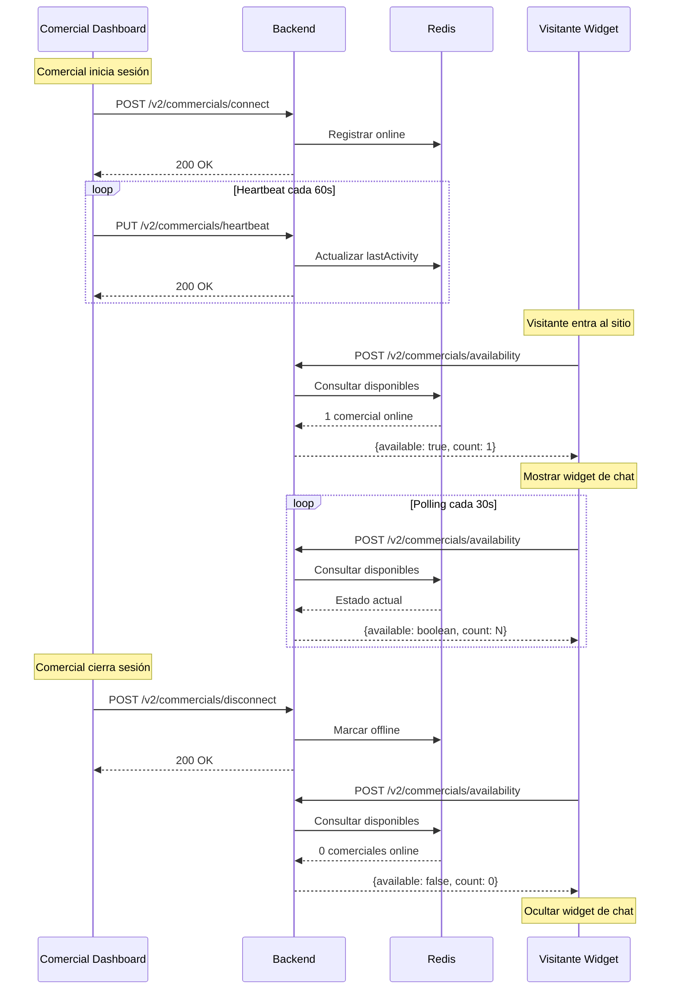

# Guías de Integración Frontend

Este documento contiene links a las guías de integración para los diferentes frontends del sistema Guiders.

## 📚 Guías Disponibles

### 1. [Guía Frontend Comercial](./GUIA-FRONTEND-COMERCIAL.md)

**Para:** Dashboard de comerciales / Aplicación web de agentes

**Contenido:**
- Cómo conectar un comercial al iniciar sesión
- Sistema de heartbeat para mantener presencia activa
- Desconexión al cerrar sesión
- Manejo de estados de conexión (online, busy, offline)
- Reconexión automática en caso de errores
- Ejemplos completos en TypeScript

**Casos de uso:**
- ✅ Informar al sistema que el comercial está disponible
- ✅ Mantener sesión activa con heartbeats automáticos
- ✅ Notificar cuando el comercial cierra sesión

---

### 2. [Guía Frontend Visitante](./GUIA-FRONTEND-VISITANTE.md)

**Para:** Widget de chat en sitios web de clientes

**Contenido:**
- Consultar disponibilidad de comerciales antes de mostrar el chat
- Estrategias de polling (estándar, adaptativo, con backoff)
- Mostrar/ocultar widget dinámicamente
- Optimizaciones de rendimiento
- Integración con analytics
- Ejemplos completos en TypeScript

**Casos de uso:**
- ✅ Mostrar widget solo cuando hay comerciales disponibles
- ✅ Ocultar widget automáticamente cuando no hay nadie disponible
- ✅ Mostrar contador de comerciales online (opcional)

---

## 🚀 Flujo Completo del Sistema

---

## 🔑 Conceptos Clave

### Para Comerciales

**Heartbeat (Latido):**
- Señal periódica cada 60 segundos
- Mantiene al comercial como "activo"
- Si no se recibe por 5 minutos → comercial marcado como offline automáticamente

**Estados de Conexión:**
- `online` - Disponible para atender chats
- `busy` - Conectado pero ocupado (no recibe nuevos chats)
- `offline` - Desconectado (no aparece como disponible)

### Para Visitantes

**Polling:**
- Consulta periódica cada 30 segundos
- Actualiza la disponibilidad sin necesidad de recargar la página
- Puede pausarse cuando la página no está visible (optimización)

**Endpoint Público:**
- No requiere autenticación previa del visitante
- Valida usando domain + API Key del sitio
- Retorna solo información pública (no expone datos de comerciales)

---

## 📊 Comparación de Enfoques

| Aspecto | Comercial | Visitante |
|---------|-----------|-----------|
| **Autenticación** | JWT Bearer Token | Domain + API Key |
| **Frecuencia de consulta** | Heartbeat cada 60s | Polling cada 30s |
| **Método** | PUT/POST | POST |
| **Endpoint principal** | `/v2/commercials/heartbeat` | `/v2/commercials/availability` |
| **Iniciativa** | Activa (push) | Pasiva (pull) |
| **Reconexión** | Automática con retry | Retry con backoff |

---

## 🛠️ Stack Tecnológico Recomendado

### Frontend Comercial
- **Framework:** React, Next.js, Vue, Angular
- **State Management:** Redux, Zustand, Pinia
- **HTTP Client:** Fetch API, Axios
- **WebSocket:** Socket.io-client (para notificaciones en tiempo real)

### Frontend Visitante (Widget)
- **Framework:** Vanilla JS, Preact (ligero)
- **Bundler:** Rollup, Webpack
- **HTTP Client:** Fetch API
- **Tamaño objetivo:** < 50KB gzipped

---

## 🔒 Seguridad

### Comerciales
- ✅ Todos los endpoints requieren autenticación JWT
- ✅ Token debe renovarse antes de expirar
- ✅ HTTPS obligatorio en producción

### Visitantes
- ✅ Validación de API Key + dominio
- ✅ Rate limiting por IP (futuro)
- ✅ No expone información sensible de comerciales
- ✅ CORS configurado para dominios autorizados

---

## 📈 Métricas y Monitoreo

### KPIs a Trackear

**Comerciales:**
- Tiempo promedio de sesión activa
- Número de desconexiones inesperadas
- Tasa de éxito de heartbeats

**Visitantes:**
- Porcentaje de visitas con widget visible
- Tiempo promedio entre consultas de disponibilidad
- Tasa de error en consultas de disponibilidad

---

## 🚨 Troubleshooting Común

### Problema: Widget no aparece

**Posibles causas:**
- ✅ Verificar que API Key sea correcta
- ✅ Verificar que el dominio esté registrado
- ✅ Verificar que haya comerciales online (consultar `/v2/commercials/active`)
- ✅ Revisar consola del navegador para errores

### Problema: Comercial aparece como offline

**Posibles causas:**
- ✅ Verificar que heartbeat se esté enviando cada 60s
- ✅ Verificar que no haya errores 401 (token expirado)
- ✅ Verificar conexión a internet del comercial
- ✅ Revisar logs del backend

### Problema: Alta latencia en consultas

**Soluciones:**
- ✅ Implementar cache local en el frontend
- ✅ Reducir frecuencia de polling (aumentar intervalo)
- ✅ Usar polling adaptativo (más lento cuando no hay comerciales)

---

## 📞 Soporte

**Documentación:**
- [Guía Frontend Comercial](./GUIA-FRONTEND-COMERCIAL.md)
- [Guía Frontend Visitante](./GUIA-FRONTEND-VISITANTE.md)
- [API Reference](./api-ai/README.md)

**Contacto:**
- Email: support@guiders.com
- GitHub Issues: https://github.com/guiders/backend/issues

---

## 🗺️ Roadmap

### En Desarrollo
- [ ] WebSocket para notificaciones push de disponibilidad (eliminar polling)
- [ ] Cache distribuido con Redis para reducir latencia
- [ ] Rate limiting por API Key

### Futuro
- [ ] SDK JavaScript oficial para facilitar integración
- [ ] Dashboard de métricas de disponibilidad
- [ ] Modo "fuera de horario" configurable por sitio
- [ ] Smart routing (asignación inteligente de chats)

---

## 📝 Changelog

### v2.0.0 (Enero 2025)
- ✅ Nuevo endpoint de disponibilidad `/v2/commercials/availability`
- ✅ Sistema de heartbeat para comerciales
- ✅ Documentación completa de integración
- ✅ Tests E2E para ambos flujos

### v1.0.0 (Diciembre 2024)
- Sistema básico de presencia
- Endpoints CRUD de comerciales
