# Casos de Uso para Sistemas de IA

Esta sección presenta casos de uso específicos donde los sistemas de IA pueden integrarse efectivamente con el backend de Guiders, incluyendo implementaciones prácticas y patrones de diseño.

## 🎯 Casos de Uso Principales

### 1. 🤖 Chatbot de Primera Línea

**Objetivo**: Automatizar respuestas iniciales y filtrar consultas antes de escalar a agentes humanos.

**Flujo de Implementación**:

```mermaid
graph TD
    A[Visitante envía mensaje] --> B[IA recibe vía WebSocket]
    B --> C[Análisis de intención]
    C --> D{¿Puede responder?}
    D -->|Sí| E[Generar respuesta IA]
    D -->|No| F[Escalar a humano]
    E --> G[Enviar respuesta]
    F --> H[Asignar comercial]
    G --> I[Monitorear satisfacción]
    H --> I
```



**Implementación Práctica**:

```javascript
class ChatbotPrimeraLinea {
  constructor(apiKey) {
    this.api = new GuidersAPI(apiKey);
    this.nlp = new NLPProcessor();
    this.baseConocimiento = new BaseConocimiento();
  }
  
  async procesarMensaje(mensaje) {
    // 1. Analizar intención y entidades
    const analisis = await this.nlp.analizar(mensaje.content);
    
    // 2. Determinar si puede responder
    const puedeResponder = this.evaluarCapacidad(analisis);
    
    if (puedeResponder) {
      // 3. Generar respuesta contextual
      const respuesta = await this.generarRespuesta(analisis, mensaje.chatId);
      
      // 4. Enviar respuesta
      await this.api.enviarMensaje(mensaje.chatId, respuesta);
      
      // 5. Registrar interacción para aprendizaje
      await this.registrarInteraccion(mensaje, respuesta, 'automatica');
    } else {
      // 6. Escalar a humano con contexto
      await this.escalarConContexto(mensaje, analisis);
    }
  }
  
  evaluarCapacidad(analisis) {
    const criterios = {
      esPreguntaFrecuente: this.baseConocimiento.contiene(analisis.intencion),
      nivelComplejidad: analisis.complejidad < 0.7,
      requiereAccesoPrivado: !analisis.necesitaDatosPersonales,
      confianzaIA: analisis.confianza > 0.8
    };
    
    return Object.values(criterios).every(Boolean);
  }
}
```

### 2. 📊 Análisis de Sentimientos en Tiempo Real

**Objetivo**: Detectar automáticamente clientes insatisfechos y priorizar su atención.

**Métricas Clave**:
- Detección de sentimiento negativo (score < -0.5)
- Escalación automática para casos críticos
- Alertas a supervisores en tiempo real

```javascript
class AnalizadorSentimientos {
  constructor(apiKey) {
    this.api = new GuidersAPI(apiKey);
    this.sentiment = new SentimentAnalyzer();
    this.alertas = new AlertManager();
  }
  
  async monitorearChats() {
    // Configurar listener de WebSocket
    this.api.socket.on('message:new', async (data) => {
      if (data.sender.role === 'visitor') {
        await this.procesarSentimiento(data);
      }
    });
  }
  
  async procesarSentimiento(mensaje) {
    // 1. Analizar sentimiento del mensaje
    const analisis = await this.sentiment.analizar(mensaje.content);
    
    // 2. Evaluar severidad
    if (analisis.score < -0.7 && analisis.confidence > 0.8) {
      // Caso crítico
      await this.manejarCasoCritico(mensaje, analisis);
    } else if (analisis.score < -0.3) {
      // Caso de atención
      await this.marcarParaAtencion(mensaje, analisis);
    }
    
    // 3. Actualizar métricas del chat
    await this.actualizarMetricasChat(mensaje.chatId, analisis);
  }
  
  async manejarCasoCritico(mensaje, analisis) {
    // 1. Priorizar chat inmediatamente
    await this.api.actualizarChat(mensaje.chatId, {
      priority: 'critical',
      tags: ['sentimiento-negativo', 'urgente'],
      metadata: {
        sentimentAlert: {
          score: analisis.score,
          trigger: 'automatic',
          timestamp: new Date().toISOString()
        }
      }
    });
    
    // 2. Asignar al mejor comercial disponible
    const comercialOptimo = await this.encontrarMejorComercial('crisis');
    if (comercialOptimo) {
      await this.api.asignarChat(mensaje.chatId, comercialOptimo.id);
    }
    
    // 3. Alertar supervisor
    await this.alertas.enviar({
      type: 'sentiment_critical',
      chatId: mensaje.chatId,
      details: analisis,
      urgency: 'high'
    });
  }
}
```

### 3. 🎨 Personalización Dinámica de Respuestas

**Objetivo**: Adaptar el tono y contenido de las respuestas según el perfil del visitante.

```javascript
class PersonalizadorRespuestas {
  constructor(apiKey) {
    this.api = new GuidersAPI(apiKey);
    this.perfilador = new PerfiladorVisitantes();
    this.generador = new GeneradorRespuestas();
  }
  
  async personalizarRespuesta(chatId, consulta) {
    // 1. Obtener perfil del visitante
    const chat = await this.api.obtenerChat(chatId);
    const perfil = await this.perfilador.obtenerPerfil(chat.visitorInfo);
    
    // 2. Adaptar respuesta según perfil
    const contexto = {
      perfil: perfil,
      historicoChat: await this.api.obtenerMensajes(chatId),
      preferenciasTono: this.determinarTono(perfil),
      nivelTecnico: this.evaluarNivelTecnico(perfil)
    };
    
    // 3. Generar respuesta personalizada
    const respuesta = await this.generador.generar(consulta, contexto);
    
    return respuesta;
  }
  
  determinarTono(perfil) {
    // Lógica para determinar tono apropiado
    const indicadores = {
      edad: perfil.demographics?.age,
      profesion: perfil.professional?.role,
      comportamientoPrevio: perfil.behavior?.chatHistory,
      valorCliente: perfil.business?.ltv
    };
    
    if (indicadores.valorCliente > 10000) return 'premium';
    if (indicadores.profesion?.includes('developer')) return 'tecnico';
    if (indicadores.edad < 25) return 'casual';
    
    return 'profesional';
  }
}
```

### 4. 🚀 Escalación Inteligente

**Objetivo**: Determinar automáticamente cuándo y a quién escalar una conversación.

```javascript
class EscaladorInteligente {
  constructor(apiKey) {
    this.api = new GuidersAPI(apiKey);
    this.ml = new ModeloEscalacion();
    this.router = new RouterComerciales();
  }
  
  async evaluarEscalacion(chatId, contexto) {
    // 1. Recopilar datos para decisión
    const datos = await this.recopilarDatos(chatId);
    
    // 2. Usar modelo ML para decidir escalación
    const decision = await this.ml.predecir(datos);
    
    if (decision.debeEscalar) {
      // 3. Encontrar el comercial más apropiado
      const comercial = await this.router.encontrarMejor({
        especialidad: decision.especialidadRequerida,
        disponibilidad: 'available',
        cargaTrabajo: 'optimal',
        experiencia: decision.nivelExperienciaRequerido
      });
      
      // 4. Realizar escalación con contexto
      await this.escalarConContexto(chatId, comercial, decision);
    }
    
    return decision;
  }
  
  async recopilarDatos(chatId) {
    const [chat, mensajes, visitante, metricas] = await Promise.all([
      this.api.obtenerChat(chatId),
      this.api.obtenerMensajes(chatId),
      this.api.obtenerVisitante(chat.visitorInfo.id),
      this.api.obtenerMetricasChat(chatId)
    ]);
    
    return {
      // Datos del chat
      duracion: Date.now() - new Date(chat.createdAt).getTime(),
      numeroMensajes: mensajes.length,
      sentimientoPromedio: this.calcularSentimientoPromedio(mensajes),
      
      // Datos del visitante
      valorPotencial: visitante.metadata?.ltv,
      esClienteExistente: visitante.metadata?.isExistingCustomer,
      nivelTecnico: this.evaluarNivelTecnico(mensajes),
      
      // Contexto conversacional
      temaPrincipal: this.extraerTema(mensajes),
      complejidadConsulta: this.evaluarComplejidad(mensajes),
      intentosResolucionIA: metricas.aiAttempts || 0
    };
  }
}
```

### 5. 📈 Optimización de Conversiones

**Objetivo**: Identificar oportunidades de venta y guiar conversaciones hacia conversión.

```javascript
class OptimizadorConversiones {
  constructor(apiKey) {
    this.api = new GuidersAPI(apiKey);
    this.predictor = new PredictorConversion();
    this.estrategias = new EstrategiasVenta();
  }
  
  async optimizarChat(chatId) {
    // 1. Analizar probabilidad de conversión
    const probabilidad = await this.predictor.calcular(chatId);
    
    // 2. Aplicar estrategia según probabilidad
    if (probabilidad.score > 0.8) {
      await this.aplicarEstrategiaAltaConversion(chatId, probabilidad);
    } else if (probabilidad.score > 0.5) {
      await this.aplicarEstrategiaMedia(chatId, probabilidad);
    } else {
      await this.aplicarEstrategiaNurturing(chatId, probabilidad);
    }
  }
  
  async aplicarEstrategiaAltaConversion(chatId, prediccion) {
    // 1. Asignar al mejor comercial de ventas
    const comercialTop = await this.api.obtenerComercialTop('ventas');
    await this.api.asignarChat(chatId, comercialTop.id);
    
    // 2. Proporcionar contexto al comercial
    await this.api.enviarMensajePrivado(comercialTop.id, {
      type: 'sales_opportunity',
      chatId: chatId,
      conversionProbability: prediccion.score,
      suggestedActions: prediccion.actions,
      customerValue: prediccion.estimatedValue
    });
    
    // 3. Preparar materiales de venta
    const materiales = await this.estrategias.prepararMateriales(prediccion);
    await this.api.adjuntarRecursos(chatId, materiales);
  }
}
```

### 6. 🔍 Análisis Predictivo de Comportamiento

**Objetivo**: Predecir el comportamiento futuro del visitante basado en patrones actuales.

```javascript
class AnalizadorPredictivo {
  constructor(apiKey) {
    this.api = new GuidersAPI(apiKey);
    this.ml = new ModeloPredictivo();
    this.segmentador = new SegmentadorClientes();
  }
  
  async analizarVisitante(visitorId) {
    // 1. Recopilar historial completo
    const historial = await this.recopilarHistorial(visitorId);
    
    // 2. Generar predicciones
    const predicciones = await this.ml.predecir({
      probabilidadCompra: historial.interacciones,
      valorPotencial: historial.comportamiento,
      riesgoAbandono: historial.engagement,
      momentoOptimalContacto: historial.patrones
    });
    
    // 3. Segmentar cliente
    const segmento = await this.segmentador.clasificar(predicciones);
    
    // 4. Activar estrategias automáticas
    await this.activarEstrategias(visitorId, segmento, predicciones);
    
    return { predicciones, segmento };
  }
  
  async activarEstrategias(visitorId, segmento, predicciones) {
    const estrategias = {
      'high-value-prospect': async () => {
        // Asignar comercial senior inmediatamente
        await this.api.crearChatPrioritario(visitorId, 'senior');
      },
      
      'price-sensitive': async () => {
        // Activar bot con ofertas y descuentos
        await this.api.activarBotEspecializado(visitorId, 'ofertas');
      },
      
      'technical-buyer': async () => {
        // Conectar con especialista técnico
        await this.api.routearAEspecialista(visitorId, 'tecnico');
      },
      
      'at-risk': async () => {
        // Intervención proactiva para evitar abandono
        await this.api.activarRetencion(visitorId);
      }
    };
    
    if (estrategias[segmento]) {
      await estrategias[segmento]();
    }
  }
}
```

## 🔄 Flujos de Integración Completos

### Flujo 1: Sistema de IA Integral

```mermaid
sequenceDiagram
    participant V as Visitante
    participant WS as WebSocket
    participant IA as Sistema IA
    participant API as Guiders API
    participant C as Comercial
    participant ML as ML Models
    
    V->>WS: Mensaje inicial
    WS->>IA: Evento message:new
    IA->>ML: Analizar intención + sentimiento
    ML->>IA: Clasificación + confianza
    
    alt Consulta simple + alta confianza
        IA->>API: Enviar respuesta automática
        API->>V: Respuesta IA
    else Consulta compleja o baja confianza
        IA->>API: Buscar comercial óptimo
        IA->>API: Asignar chat + contexto
        API->>C: Notificación asignación
        C->>API: Responder al visitante
    end
    
    IA->>ML: Registrar interacción para aprendizaje
```



### Flujo 2: Análisis Continuo y Optimización

```mermaid
graph TD
    A[Inicio Conversación] --> B[Análisis Inicial]
    B --> C[Clasificación Visitante]
    C --> D[Estrategia Personalizada]
    D --> E[Monitoreo Continuo]
    E --> F{¿Cambio Significativo?}
    F -->|Sí| G[Reajustar Estrategia]
    F -->|No| H[Continuar Monitoreo]
    G --> E
    H --> E
    E --> I[Fin Conversación]
    I --> J[Análisis Post-Conversación]
    J --> K[Actualizar Modelos ML]
```



## 📊 Métricas y KPIs para IA

### Métricas de Rendimiento

```javascript
class MetricasIA {
  constructor(apiKey) {
    this.api = new GuidersAPI(apiKey);
    this.metricas = new Map();
  }
  
  async calcularKPIs(periodo = '24h') {
    const datos = await this.api.obtenerDatosMetricas(periodo);
    
    return {
      // Eficiencia del Bot
      tasaResolucionAutomatica: this.calcularTasaResolucion(datos),
      tiempoPromedioRespuesta: this.calcularTiempoRespuesta(datos),
      precisionClasificacion: this.calcularPrecision(datos),
      
      // Satisfacción del Cliente
      satisfaccionPromedioIA: this.calcularSatisfaccionIA(datos),
      tasaEscalacion: this.calcularTasaEscalacion(datos),
      reduccionTiempoEspera: this.calcularReduccionEspera(datos),
      
      // Impacto en Negocio
      conversionesGeneradasIA: this.calcularConversionesIA(datos),
      ahorrosCostos: this.calcularAhorros(datos),
      incrementoProductividad: this.calcularProductividad(datos)
    };
  }
}
```

## 🎯 Casos de Uso por Industria

### E-commerce
- **Bot de soporte producto**: Respuestas sobre especificaciones, disponibilidad, envíos
- **Asistente de compra**: Recomendaciones personalizadas y comparaciones
- **Gestión devoluciones**: Automatización de proceso de devoluciones y cambios

### SaaS
- **Onboarding automatizado**: Guiar nuevos usuarios a través de configuración inicial
- **Soporte técnico L1**: Resolver problemas comunes de configuración y uso
- **Upselling inteligente**: Identificar oportunidades de upgrade basado en uso

### Servicios Financieros
- **Asesor virtual**: Información sobre productos financieros y requisitos
- **Detección fraude**: Análisis de patrones sospechosos en conversaciones
- **Compliance automatizado**: Verificación automática de cumplimiento normativo

---

> **Recomendación**: Comienza implementando un caso de uso simple como el chatbot de primera línea, luego expande gradualmente a casos más complejos como análisis predictivo y personalización avanzada.