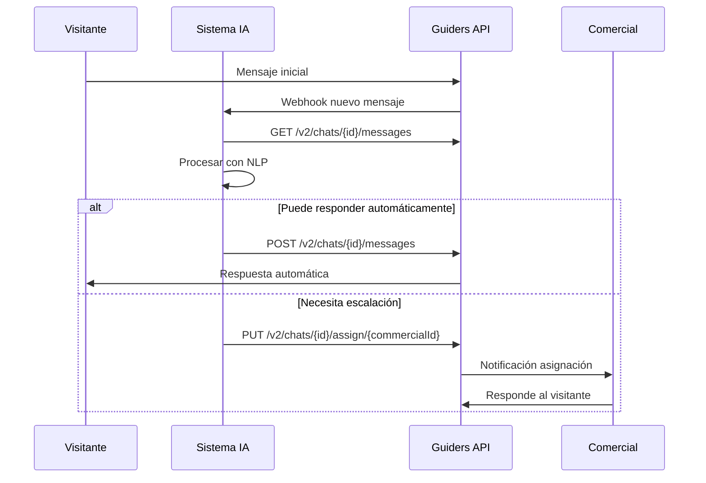
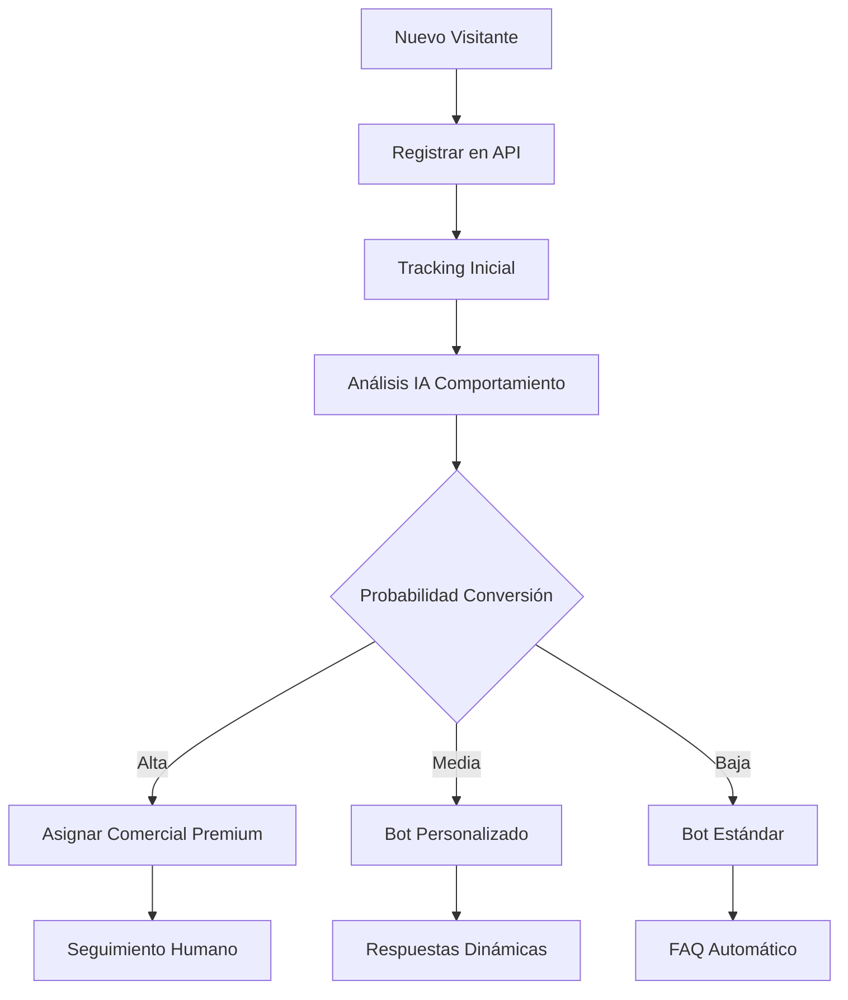

# Endpoints por Contexto - Guía para IA

Esta sección documenta todos los endpoints disponibles organizados por contexto de negocio, con ejemplos específicos para casos de uso de IA.

## 📑 Contextos Disponibles

1. [Autenticación](auth.md) - Gestión de tokens y credenciales
2. [Chats V2](chats-v2.md) - Conversaciones y mensajes (Recomendado para IA)
3. [Chats V1](chats-v1.md) - API legacy de conversaciones
4. [Visitantes](visitantes.md) - Gestión de usuarios del sitio web
5. [Comerciales](comerciales.md) - Gestión de agentes de ventas
6. [Tracking](tracking.md) - Eventos de comportamiento y analytics
7. [Empresa](empresa.md) - Configuración de cuentas y empresas
8. [Tiempo Real](tiempo-real.md) - WebSockets y eventos

## 🎯 Endpoints Más Relevantes para IA

### 🚀 Alta Prioridad (Uso Diario)

| Endpoint | Método | Descripción | Caso de Uso IA |
|----------|--------|-------------|-----------------|
| `/api/v2/chats` | GET | Lista chats con filtros avanzados | Obtener conversaciones para procesar |
| `/api/v2/chats/{id}/messages` | GET | Mensajes de un chat específico | Analizar historial de conversación |
| `/api/v2/chats/{id}/messages` | POST | Enviar mensaje a un chat | Responder automáticamente |
| `/api/v2/chats/{id}/assign/{commercialId}` | PUT | Asignar chat a comercial | Derivar a humano cuando sea necesario |
| `/api/auth/visitor/register` | POST | Registrar visitante | Crear sesión para chatbot |

### 📊 Media Prioridad (Análisis y Métricas)

| Endpoint | Método | Descripción | Caso de Uso IA |
|----------|--------|-------------|-----------------|
| `/api/v2/chats/metrics/commercial/{id}` | GET | Métricas de comercial | Análisis de rendimiento |
| `/api/v2/chats/stats/response-time` | GET | Estadísticas de tiempo respuesta | Optimización de tiempos |
| `/api/tracking/events` | POST | Registrar evento de tracking | Análisis comportamental |
| `/api/visitors` | GET | Lista de visitantes | Segmentación y personalización |

### 🔧 Baja Prioridad (Administración)

| Endpoint | Método | Descripción | Caso de Uso IA |
|----------|--------|-------------|-----------------|
| `/api/companies` | GET | Información de empresas | Configuración multi-tenant |
| `/api/auth/users` | GET | Lista de usuarios | Gestión de permisos |

## 📈 Patrones Comunes de Uso

### 1. Chatbot Reactivo
```javascript
// Flujo típico para chatbot que responde a mensajes
async function procesarNuevosMensajes() {
  // 1. Obtener chats pendientes
  const chatsPendientes = await obtenerChats({
    status: 'PENDING',
    assignedTo: null,
    limit: 50
  });
  
  // 2. Procesar cada chat
  for (const chat of chatsPendientes) {
    const mensajes = await obtenerMensajes(chat.id);
    const ultimoMensaje = mensajes[mensajes.length - 1];
    
    // 3. Generar respuesta con IA
    const respuesta = await generarRespuestaIA(ultimoMensaje.content);
    
    // 4. Enviar respuesta
    await enviarMensaje(chat.id, respuesta);
  }
}
```

### 2. Análisis de Sentimientos
```javascript
// Análisis de sentimientos en tiempo real
async function analizarSentimientos() {
  const chatsActivos = await obtenerChats({ status: 'ACTIVE' });
  
  for (const chat of chatsActivos) {
    const mensajes = await obtenerMensajes(chat.id, { limit: 10 });
    const sentimiento = await analizarSentimiento(mensajes);
    
    if (sentimiento.score < -0.5) {
      // Escalar chat urgente
      await asignarChat(chat.id, 'supervisor-id');
      await agregarEtiqueta(chat.id, 'urgente');
    }
  }
}
```

### 3. Clasificación Automática
```javascript
// Clasificar chats por categoría
async function clasificarChats() {
  const chatsSinClasificar = await obtenerChats({
    tags: { $ne: ['clasificado'] }
  });
  
  for (const chat of chatsSinClasificar) {
    const mensajes = await obtenerMensajes(chat.id);
    const categoria = await clasificarConIA(mensajes);
    
    await actualizarChat(chat.id, {
      tags: [categoria, 'clasificado'],
      department: mapearDepartamento(categoria)
    });
  }
}
```

## 🔄 Flujos de Integración Completos

### Flujo 1: Chatbot de Primera Línea



### Flujo 2: Análisis Predictivo



## 🎛️ Configuración por Contexto

### Autenticación para IA
```javascript
const configAuth = {
  metodo: 'api-key',
  headers: {
    'Authorization': 'Bearer API_KEY',
    'User-Agent': 'SistemaIA/1.0',
    'X-AI-Model': 'gpt-4' // Opcional, para auditoría
  },
  timeout: 30000 // 30 segundos
};
```

### Rate Limiting Optimizado
```javascript
const rateLimits = {
  lecturas: 500, // requests/hora para GET
  escrituras: 100, // requests/hora para POST/PUT
  burst: 10 // requests/segundo máximo
};
```

### Filtros Inteligentes
```javascript
// Configuración de filtros para IA
const filtrosIA = {
  chatsRelevantes: {
    status: ['ACTIVE', 'PENDING'],
    updatedAt: { $gte: new Date(Date.now() - 3600000) }, // Última hora
    assignedTo: null // Sin asignar
  },
  mensajesRecientes: {
    limit: 50,
    sort: { createdAt: -1 },
    type: { $ne: 'system' } // Excluir mensajes del sistema
  }
};
```

## 📚 Documentación Específica

- **[Chats V2](chats-v2.md)**: Endpoints principales para conversaciones
- **[Autenticación](auth.md)**: Métodos de autenticación específicos para IA
- **[WebSockets](tiempo-real.md)**: Integración en tiempo real
- **[Tracking](tracking.md)**: Analytics y eventos de comportamiento
- **[Visitantes](visitantes.md)**: Gestión de usuarios y segmentación

## 🛠️ Herramientas de Desarrollo

### Testing de Endpoints
```bash
# Colección Postman para testing
curl -X GET "https://api.guiders.com/api/v2/chats" \
  -H "Authorization: Bearer YOUR_API_KEY" \
  -H "Content-Type: application/json"
```

### Monitoreo de APIs
```javascript
// Healthcheck para sistemas IA
async function verificarSaludAPI() {
  try {
    const response = await fetch('/api/health');
    const metrics = await fetch('/api/v2/chats?limit=1');
    
    return {
      status: response.ok ? 'healthy' : 'unhealthy',
      latency: metrics.headers.get('X-Response-Time'),
      timestamp: new Date().toISOString()
    };
  } catch (error) {
    return { status: 'error', error: error.message };
  }
}
```

---

> **Tip**: Comienza con los endpoints de alta prioridad para validar tu integración, luego expande a funcionalidades más avanzadas según tus necesidades específicas de IA.