# Flujos de Integración End-to-End

Esta guía presenta flujos completos de integración para sistemas de IA, desde la configuración inicial hasta casos de uso avanzados en producción.

## 🎯 Flujos Principales

### 1. 🤖 Chatbot de Primera Línea

**Objetivo**: Automatizar respuestas iniciales y filtrar consultas complejas.


**Implementación paso a paso:**

#### Paso 1: Configuración Inicial

```javascript
// config/ai-chatbot.js
const config = {
  guiders: {
    apiKey: process.env.GUIDERS_API_KEY,
    baseURL: 'https://api.guiders.com/api',
    websocketURL: 'wss://api.guiders.com'
  },
  ai: {
    provider: 'openai', // openai, huggingface, custom
    model: 'gpt-3.5-turbo',
    apiKey: process.env.OPENAI_API_KEY,
    maxTokens: 150,
    temperature: 0.7
  },
  behavior: {
    autoRespondThreshold: 0.8, // Confianza mínima para responder automáticamente
    escalationKeywords: ['precio', 'cotización', 'venta', 'urgente'],
    maxMessagesBeforeEscalation: 5,
    responseDelay: 1000 // Simular tiempo de escritura humana
  }
};
```

#### Paso 2: Inicialización del Sistema

```javascript
// src/chatbot.js
class ChatbotPrimeraLinea {
  constructor(config) {
    this.config = config;
    this.guidersClient = new GuidersClient(config.guiders);
    this.aiClient = new AIClient(config.ai);
    this.activeChats = new Map();
    this.conversationHistory = new Map();
  }
  
  async inicializar() {
    // Conectar WebSocket
    await this.guidersClient.connectWebSocket();
    
    // Configurar event listeners
    this.configurarEventListeners();
    
    // Cargar contexto existente
    await this.cargarChatsActivos();
    
    console.log('🤖 Chatbot inicializado y listo');
  }
  
  configurarEventListeners() {
    // Nuevos chats
    this.guidersClient.on('chat:created', async (data) => {
      await this.manejarNuevoChat(data);
    });
    
    // Nuevos mensajes
    this.guidersClient.on('message:new', async (data) => {
      if (data.sender.role === 'visitor') {
        await this.procesarMensajeVisitante(data);
      }
    });
    
    // Chats asignados (dejar de procesar)
    this.guidersClient.on('chat:assigned', (data) => {
      this.activeChats.delete(data.chatId);
      console.log(`Chat ${data.chatId} asignado a comercial, deteniendo IA`);
    });
  }
  
  async manejarNuevoChat(chatData) {
    const chatId = chatData.chatId;
    
    // Registrar chat activo
    this.activeChats.set(chatId, {
      id: chatId,
      createdAt: new Date(),
      messageCount: 0,
      lastActivity: new Date(),
      visitorInfo: chatData.visitorInfo
    });
    
    // Enviar mensaje de bienvenida
    await this.enviarMensajeBienvenida(chatId, chatData.visitorInfo);
  }
  
  async enviarMensajeBienvenida(chatId, visitorInfo) {
    const nombre = visitorInfo?.name || 'amigo';
    const mensaje = `¡Hola ${nombre}! 👋 Soy tu asistente virtual. ¿En qué puedo ayudarte hoy?`;
    
    // Simular tiempo de escritura
    await this.sleep(this.config.behavior.responseDelay);
    
    await this.guidersClient.sendMessage(chatId, {
      content: mensaje,
      type: 'ai-response',
      metadata: {
        isWelcome: true,
        aiModel: this.config.ai.model,
        timestamp: new Date().toISOString()
      }
    });
  }
  
  async procesarMensajeVisitante(messageData) {
    const chatId = messageData.chatId;
    const chat = this.activeChats.get(chatId);
    
    if (!chat) {
      return; // Chat no activo o ya asignado
    }
    
    // Actualizar estadísticas del chat
    chat.messageCount++;
    chat.lastActivity = new Date();
    
    // Obtener historial de conversación
    const historial = await this.obtenerHistorialConversacion(chatId);
    
    // Decidir si responder automáticamente
    const decision = await this.evaluarRespuestaAutomatica(messageData, historial);
    
    if (decision.shouldRespond) {
      await this.generarYEnviarRespuesta(messageData, decision.context);
    } else {
      await this.escalarAComercial(chatId, decision.reason);
    }
  }
  
  async evaluarRespuestaAutomatica(messageData, historial) {
    const contenido = messageData.content.toLowerCase();
    
    // Verificar palabras clave de escalación
    const tieneKeywordEscalacion = this.config.behavior.escalationKeywords
      .some(keyword => contenido.includes(keyword));
    
    if (tieneKeywordEscalacion) {
      return {
        shouldRespond: false,
        reason: 'escalation_keyword_detected',
        context: { detectedKeywords: this.config.behavior.escalationKeywords.filter(k => contenido.includes(k)) }
      };
    }
    
    // Verificar límite de mensajes
    if (historial.length >= this.config.behavior.maxMessagesBeforeEscalation) {
      return {
        shouldRespond: false,
        reason: 'max_messages_reached',
        context: { messageCount: historial.length }
      };
    }
    
    // Analizar complejidad de la consulta
    const complejidad = await this.analizarComplejidad(contenido, historial);
    
    if (complejidad.score < this.config.behavior.autoRespondThreshold) {
      return {
        shouldRespond: false,
        reason: 'query_too_complex',
        context: { complexityScore: complejidad.score, factors: complejidad.factors }
      };
    }
    
    return {
      shouldRespond: true,
      context: { complexityScore: complejidad.score, historial: historial }
    };
  }
  
  async generarYEnviarRespuesta(messageData, context) {
    try {
      // Indicar que está escribiendo
      await this.mostrarIndicadorEscritura(messageData.chatId);
      
      // Generar respuesta con IA
      const respuesta = await this.aiClient.generateResponse({
        message: messageData.content,
        history: context.historial,
        visitorInfo: this.activeChats.get(messageData.chatId).visitorInfo
      });
      
      // Simular tiempo de escritura humana
      const tiempoEscritura = Math.min(
        respuesta.content.length * 50, // 50ms por carácter
        5000 // Máximo 5 segundos
      );
      
      await this.sleep(tiempoEscritura);
      
      // Enviar respuesta
      await this.guidersClient.sendMessage(messageData.chatId, {
        content: respuesta.content,
        type: 'ai-response',
        metadata: {
          aiModel: this.config.ai.model,
          confidence: respuesta.confidence,
          processingTime: respuesta.processingTime,
          contextUsed: !!context.historial.length
        }
      });
      
    } catch (error) {
      console.error('Error generando respuesta IA:', error);
      await this.enviarRespuestaFallback(messageData.chatId);
    }
  }
  
  async escalarAComercial(chatId, razon) {
    try {
      // Buscar comercial disponible
      const comerciales = await this.guidersClient.getCommercials({
        status: 'available',
        orderBy: 'workload'
      });
      
      if (comerciales.data.length === 0) {
        // No hay comerciales disponibles
        await this.guidersClient.sendMessage(chatId, {
          content: 'En este momento no hay agentes disponibles. Te atenderemos en breve. Tu consulta es importante para nosotros.',
          type: 'ai-response',
          metadata: {
            isEscalationPending: true,
            reason: 'no_agents_available'
          }
        });
        return;
      }
      
      const comercialOptimo = comerciales.data[0];
      
      // Asignar chat
      await this.guidersClient.assignChat(chatId, comercialOptimo.id);
      
      // Enviar contexto al comercial
      await this.enviarContextoAComercial(chatId, comercialOptimo.id, razon);
      
      // Notificar al visitante
      await this.guidersClient.sendMessage(chatId, {
        content: `He derivado tu consulta a ${comercialOptimo.name}, nuestro especialista. Te responderá en breve.`,
        type: 'ai-response',
        metadata: {
          isEscalation: true,
          assignedTo: comercialOptimo.id,
          escalationReason: razon
        }
      });
      
    } catch (error) {
      console.error('Error escalando a comercial:', error);
      await this.enviarRespuestaFallback(chatId);
    }
  }
}
```

### 2. 📊 Sistema de Análisis Predictivo

**Objetivo**: Predecir comportamiento del visitante y optimizar estrategias.

```mermaid
graph TD
    A[Visitante Ingresa] --> B[Capturar Datos Iniciales]
    B --> C[Análisis Comportamental]
    C --> D[Modelo Predictivo]
    D --> E{Probabilidad Conversión}
    E -->|Alta >80%| F[Estrategia VIP]
    E -->|Media 40-80%| G[Estrategia Estándar]
    E -->|Baja <40%| H[Estrategia Nurturing]
    F --> I[Asignar Comercial Senior]
    G --> J[Bot Personalizado]
    H --> K[Contenido Educativo]
    I --> L[Seguimiento Directo]
    J --> M[Respuestas Dinámicas]
    K --> N[Email Follow-up]
```



**Implementación:**

```javascript
// src/predictive-analytics.js
class SistemaAnalisisPredictivo {
  constructor(config) {
    this.guidersClient = new GuidersClient(config.guiders);
    this.mlModel = new MLPredictionModel(config.ml);
    this.segmentador = new CustomerSegmenter();
    this.estrategias = new EstrategiaMap();
    this.metricas = new MetricsCollector();
  }
  
  async analizarVisitante(visitorId) {
    // 1. Recopilar datos del visitante
    const datosCompletos = await this.recopilarDatosCompletos(visitorId);
    
    // 2. Generar predicciones
    const predicciones = await this.mlModel.predecir(datosCompletos);
    
    // 3. Segmentar visitante
    const segmento = this.segmentador.clasificar(predicciones);
    
    // 4. Aplicar estrategia
    await this.aplicarEstrategia(visitorId, segmento, predicciones);
    
    // 5. Registrar métricas
    this.metricas.registrar('visitor_analyzed', {
      visitorId,
      segmento,
      predicciones: predicciones.summary
    });
    
    return { predicciones, segmento };
  }
  
  async recopilarDatosCompletos(visitorId) {
    const [visitante, chats, eventos, sesiones] = await Promise.all([
      this.guidersClient.getVisitor(visitorId),
      this.guidersClient.getVisitorChats(visitorId),
      this.guidersClient.getVisitorEvents(visitorId),
      this.guidersClient.getVisitorSessions(visitorId)
    ]);
    
    return {
      // Datos demográficos
      demographics: {
        location: visitante.location,
        device: this.analizarDevice(visitante.userAgent),
        timeZone: visitante.timeZone
      },
      
      // Comportamiento de navegación
      behavior: {
        paginasVistas: eventos.filter(e => e.type === 'page_view').length,
        tiempoEnSitio: this.calcularTiempoTotal(sesiones),
        fuente: visitante.source,
        campana: visitante.campaign
      },
      
      // Historial de interacciones
      interactions: {
        totalChats: chats.length,
        mensajesEnviados: this.contarMensajes(chats),
        temasConsultados: this.extraerTemas(chats),
        satisfaccionPromedio: this.calcularSatisfaccion(chats)
      },
      
      // Contexto temporal
      temporal: {
        horaDelDia: new Date().getHours(),
        diaDeLaSemana: new Date().getDay(),
        esHorarioLaboral: this.esHorarioLaboral(),
        temporadaComercial: this.obtenerTemporadaComercial()
      }
    };
  }
  
  async aplicarEstrategia(visitorId, segmento, predicciones) {
    const estrategia = this.estrategias.get(segmento);
    
    if (!estrategia) {
      console.warn(`No hay estrategia definida para segmento: ${segmento}`);
      return;
    }
    
    try {
      await estrategia.ejecutar(visitorId, predicciones);
      
      this.metricas.registrar('strategy_applied', {
        visitorId,
        segmento,
        estrategia: estrategia.name
      });
    } catch (error) {
      console.error(`Error aplicando estrategia ${estrategia.name}:`, error);
    }
  }
}
```

### 3. 🔄 Pipeline de Procesamiento en Tiempo Real

**Objetivo**: Procesar eventos en tiempo real para respuestas inmediatas.


**Implementación:**

```javascript
// src/real-time-pipeline.js
class RealTimePipeline {
  constructor(config) {
    this.eventStream = new EventStream(config.websocket);
    this.processor = new StreamProcessor(config.processing);
    this.aiEngine = new AIEngine(config.ai);
    this.decisionEngine = new DecisionEngine(config.rules);
    this.actionDispatcher = new ActionDispatcher(config.actions);
  }
  
  async inicializar() {
    // Configurar pipeline de procesamiento
    this.eventStream
      .pipe(this.processor)
      .pipe(this.aiEngine)
      .pipe(this.decisionEngine)
      .pipe(this.actionDispatcher);
    
    // Iniciar stream
    await this.eventStream.start();
    
    console.log('🚀 Pipeline de tiempo real iniciado');
  }
  
  // Procesador de eventos en streaming
  async procesarEventoStream(evento) {
    const contexto = {
      timestamp: new Date(),
      eventType: evento.type,
      source: 'websocket-stream'
    };
    
    try {
      // 1. Filtrar eventos relevantes
      if (!this.esEventoRelevante(evento)) {
        return;
      }
      
      // 2. Enriquecer con contexto
      const eventoEnriquecido = await this.enriquecerEvento(evento);
      
      // 3. Procesar con IA
      const analisisIA = await this.aiEngine.analizar(eventoEnriquecido);
      
      // 4. Tomar decisión
      const decision = await this.decisionEngine.decidir(analisisIA);
      
      // 5. Ejecutar acciones
      if (decision.actions.length > 0) {
        await this.actionDispatcher.ejecutar(decision.actions, contexto);
      }
      
    } catch (error) {
      console.error('Error en pipeline de tiempo real:', error);
      await this.manejarErrorPipeline(error, evento, contexto);
    }
  }
}
```

## 🚀 Patrones de Implementación

### Patrón: Circuit Breaker para IA

```javascript
class AICircuitBreaker {
  constructor(options = {}) {
    this.failureThreshold = options.failureThreshold || 5;
    this.recoveryTimeout = options.recoveryTimeout || 30000;
    this.monitoringPeriod = options.monitoringPeriod || 60000;
    
    this.state = 'CLOSED'; // CLOSED, OPEN, HALF_OPEN
    this.failures = 0;
    this.lastFailureTime = null;
    this.successCount = 0;
  }
  
  async execute(aiOperation, fallback = null) {
    if (this.state === 'OPEN') {
      if (Date.now() - this.lastFailureTime < this.recoveryTimeout) {
        // Circuit está abierto, usar fallback
        return fallback ? await fallback() : this.getDefaultResponse();
      }
      
      // Intentar recuperación
      this.state = 'HALF_OPEN';
      this.successCount = 0;
    }
    
    try {
      const result = await aiOperation();
      this.onSuccess();
      return result;
    } catch (error) {
      this.onFailure();
      
      if (fallback) {
        return await fallback();
      }
      
      throw error;
    }
  }
  
  onSuccess() {
    this.failures = 0;
    
    if (this.state === 'HALF_OPEN') {
      this.successCount++;
      
      if (this.successCount >= 3) {
        this.state = 'CLOSED';
      }
    }
  }
  
  onFailure() {
    this.failures++;
    this.lastFailureTime = Date.now();
    
    if (this.failures >= this.failureThreshold) {
      this.state = 'OPEN';
    }
  }
}
```

### Patrón: Event Sourcing para Auditoría

```javascript
class EventSourcingManager {
  constructor(config) {
    this.eventStore = new EventStore(config.storage);
    this.projections = new Map();
    this.subscribers = new Map();
  }
  
  async guardarEvento(evento) {
    // Enriquecer evento con metadatos
    const eventoCompleto = {
      ...evento,
      id: this.generateEventId(),
      timestamp: new Date().toISOString(),
      version: 1,
      metadata: {
        source: 'ai-system',
        correlationId: this.getCorrelationId(),
        userId: this.getCurrentUserId()
      }
    };
    
    // Persistir evento
    await this.eventStore.append(eventoCompleto);
    
    // Actualizar proyecciones
    await this.actualizarProyecciones(eventoCompleto);
    
    // Notificar suscriptores
    await this.notificarSuscriptores(eventoCompleto);
    
    return eventoCompleto;
  }
  
  async reproducirEventos(agregadoId, fromVersion = 0) {
    const eventos = await this.eventStore.getEvents(agregadoId, fromVersion);
    return eventos.map(evento => this.deserializarEvento(evento));
  }
}
```

### Patrón: SAGA para Procesos Largos

```javascript
class ConversationSaga {
  constructor(config) {
    this.steps = [];
    this.compensations = [];
    this.state = 'STARTED';
    this.context = new Map();
  }
  
  addStep(name, action, compensation = null) {
    this.steps.push({ name, action, compensation });
    return this;
  }
  
  async execute(initialContext = {}) {
    this.context = new Map(Object.entries(initialContext));
    let executedSteps = [];
    
    try {
      for (const step of this.steps) {
        console.log(`Ejecutando paso: ${step.name}`);
        
        const result = await step.action(this.context);
        this.context.set(`${step.name}_result`, result);
        executedSteps.push(step);
        
        console.log(`✅ Paso completado: ${step.name}`);
      }
      
      this.state = 'COMPLETED';
      return this.context;
      
    } catch (error) {
      console.error(`❌ Error en paso: ${error.message}`);
      this.state = 'COMPENSATING';
      
      // Ejecutar compensaciones en orden inverso
      for (const step of executedSteps.reverse()) {
        if (step.compensation) {
          try {
            await step.compensation(this.context);
            console.log(`↩️ Compensación ejecutada: ${step.name}`);
          } catch (compError) {
            console.error(`❌ Error en compensación ${step.name}:`, compError);
          }
        }
      }
      
      this.state = 'FAILED';
      throw error;
    }
  }
}

// Ejemplo de uso
const conversationSaga = new ConversationSaga()
  .addStep('create_chat', 
    async (ctx) => await guidersClient.createChat(ctx.get('visitorInfo')),
    async (ctx) => await guidersClient.deleteChat(ctx.get('create_chat_result').chatId)
  )
  .addStep('analyze_intent',
    async (ctx) => await aiEngine.analyzeIntent(ctx.get('message')),
    null // No hay compensación para análisis
  )
  .addStep('generate_response',
    async (ctx) => await aiEngine.generateResponse(ctx.get('analyze_intent_result')),
    null
  )
  .addStep('send_message',
    async (ctx) => await guidersClient.sendMessage(
      ctx.get('create_chat_result').chatId,
      ctx.get('generate_response_result')
    ),
    null
  );
```

## 📈 Métricas y Observabilidad

### Dashboard de Métricas en Tiempo Real

```javascript
class MetricsDashboard {
  constructor() {
    this.metricas = {
      // Métricas de rendimiento
      responseTime: new TimeSeries(),
      throughput: new Counter(),
      errorRate: new Gauge(),
      
      // Métricas de IA
      aiConfidence: new Histogram(),
      escalationRate: new Gauge(),
      automationRate: new Gauge(),
      
      // Métricas de negocio
      conversionRate: new Gauge(),
      customerSatisfaction: new Histogram(),
      revenueImpact: new Counter()
    };
    
    this.iniciarRecoleccion();
  }
  
  iniciarRecoleccion() {
    setInterval(() => {
      this.recolectarMetricas();
    }, 10000); // Cada 10 segundos
  }
  
  async recolectarMetricas() {
    const snapshot = {
      timestamp: new Date().toISOString(),
      performance: {
        responseTime: this.metricas.responseTime.getPercentile(95),
        throughput: this.metricas.throughput.getRate(),
        errorRate: this.metricas.errorRate.getValue()
      },
      ai: {
        averageConfidence: this.metricas.aiConfidence.getMean(),
        escalationRate: this.metricas.escalationRate.getValue(),
        automationRate: this.metricas.automationRate.getValue()
      },
      business: {
        conversionRate: this.metricas.conversionRate.getValue(),
        avgSatisfaction: this.metricas.customerSatisfaction.getMean(),
        revenueImpact: this.metricas.revenueImpact.getValue()
      }
    };
    
    // Enviar a sistema de monitoreo
    await this.enviarAMonitoreo(snapshot);
    
    // Verificar alertas
    this.verificarAlertas(snapshot);
  }
}
```

## 🎯 Optimizaciones de Producción

### Configuración de Producción

```javascript
// config/production.js
const productionConfig = {
  // Configuración de base de datos
  database: {
    pool: {
      min: 5,
      max: 20,
      idle: 10000
    },
    retry: {
      max: 3,
      backoff: 'exponential'
    }
  },
  
  // Configuración de cache
  cache: {
    redis: {
      cluster: process.env.REDIS_CLUSTER_URLS.split(','),
      options: {
        enableReadyCheck: false,
        redisOptions: {
          password: process.env.REDIS_PASSWORD
        }
      }
    },
    ttl: {
      chatMessages: 300,      // 5 minutos
      userProfiles: 1800,     // 30 minutos
      aiResponses: 3600       // 1 hora
    }
  },
  
  // Configuración de IA
  ai: {
    timeout: 10000,
    maxRetries: 2,
    circuitBreaker: {
      failureThreshold: 5,
      recoveryTimeout: 30000
    },
    rateLimiting: {
      maxRequestsPerSecond: 10,
      burstCapacity: 50
    }
  },
  
  // Configuración de logging
  logging: {
    level: 'info',
    structured: true,
    destination: 'elasticsearch',
    sampling: 0.1 // 10% de logs en producción
  },
  
  // Configuración de monitoreo
  monitoring: {
    metrics: {
      interval: 10000,
      retention: '7d'
    },
    alerts: {
      responseTime: { threshold: 5000, severity: 'warning' },
      errorRate: { threshold: 0.05, severity: 'critical' },
      aiFailures: { threshold: 0.1, severity: 'warning' }
    }
  }
};
```

---

> **Importante**: Estos flujos son plantillas que deben adaptarse a las necesidades específicas de tu sistema. Comienza con implementaciones simples y evoluciona gradualmente hacia casos más complejos conforme ganes experiencia con la integración.