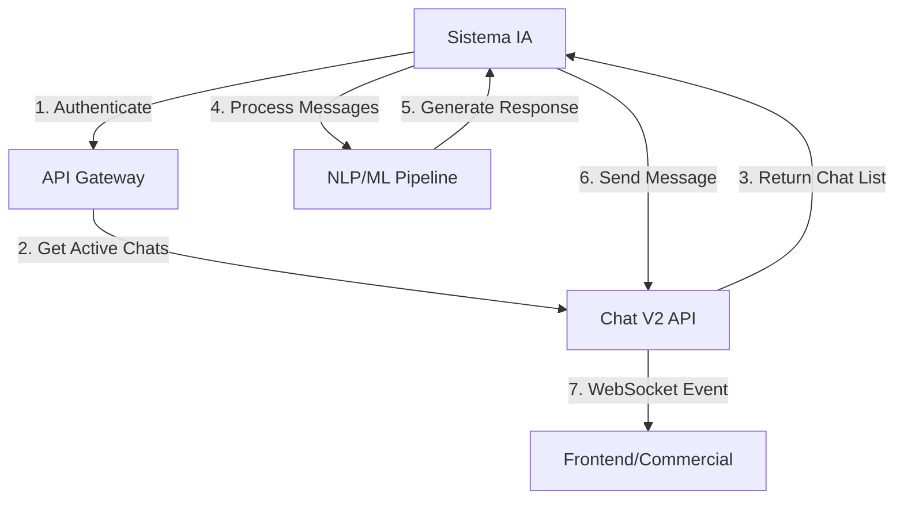

# Guía de Inicio Rápido para Sistemas de IA

Esta guía te ayudará a integrar tu sistema de IA con el backend de Guiders en minutos.

## 🎯 Casos de Uso Comunes para IA

1. **Chatbot de Atención al Cliente**: Automatizar respuestas iniciales y transferir a agentes humanos
2. **Análisis de Sentimientos**: Procesar mensajes de chat para detectar emociones y priorizar casos
3. **Clasificación Automática**: Categorizar conversaciones por tema, urgencia o departamento
4. **Respuestas Sugeridas**: Generar respuestas automáticas para comerciales
5. **Análisis Predictivo**: Predecir probabilidad de conversión basado en comportamiento del visitante

## ⚡ Setup Básico en 3 Pasos

### Paso 1: Obtener Credenciales

Necesitas una **API Key** válida para autenticar tu sistema de IA:

```bash
# Endpoint para obtener API Keys (requiere autenticación de admin)
GET /api/companies/{companyId}/api-keys
```

### Paso 2: Configurar Autenticación

```javascript
// Ejemplo básico de configuración
const GUIDERS_API_BASE = 'https://api.guiders.com/api';
const API_KEY = 'tu-api-key-aqui';

const headers = {
  'Authorization': `Bearer ${API_KEY}`,
  'Content-Type': 'application/json',
  'User-Agent': 'TuSistemaIA/1.0'
};
```

### Paso 3: Primer Request

```javascript
// Obtener lista de chats activos
async function obtenerChatsActivos() {
  const response = await fetch(`${GUIDERS_API_BASE}/v2/chats?status=ACTIVE`, {
    method: 'GET',
    headers: headers
  });
  
  if (!response.ok) {
    throw new Error(`Error: ${response.status} - ${response.statusText}`);
  }
  
  const data = await response.json();
  console.log('Chats activos:', data.data);
  return data.data;
}
```

## 🔄 Flujo Típico de Integración



## 📡 WebSocket para Tiempo Real

Para sistemas de IA que necesitan responder en tiempo real:

```javascript
import io from 'socket.io-client';

const socket = io('wss://api.guiders.com', {
  path: '/socket.io/',
  transports: ['websocket', 'polling'],
  auth: {
    token: API_KEY
  }
});

// Escuchar nuevos mensajes
socket.on('message:new', (data) => {
  console.log('Nuevo mensaje recibido:', data);
  // Procesar con tu sistema de IA
  procesarMensajeConIA(data);
});

// Enviar respuesta generada por IA
function enviarRespuestaIA(chatId, mensaje) {
  socket.emit('message:send', {
    chatId: chatId,
    content: mensaje,
    type: 'ai-response',
    metadata: {
      confidence: 0.95,
      model: 'gpt-4',
      processingTime: 150
    }
  });
}
```

## 🎨 Ejemplos por Caso de Uso

### Chatbot Básico

```python
import requests
import json

class GuidersChatbot:
    def __init__(self, api_key, base_url='https://api.guiders.com/api'):
        self.api_key = api_key
        self.base_url = base_url
        self.headers = {
            'Authorization': f'Bearer {api_key}',
            'Content-Type': 'application/json'
        }
    
    def obtener_mensaje_pendientes(self):
        """Obtiene mensajes sin respuesta para procesar"""
        response = requests.get(
            f'{self.base_url}/v2/chats',
            headers=self.headers,
            params={
                'status': 'PENDING',
                'assignedTo': 'null',  # Sin asignar a comercial
                'limit': 10
            }
        )
        return response.json()
    
    def generar_respuesta(self, mensaje):
        """Aquí iría tu lógica de IA/NLP"""
        # Ejemplo simple - en producción conecta con OpenAI, Hugging Face, etc.
        if 'precio' in mensaje.lower():
            return "Enseguida un comercial te ayudará con información de precios."
        elif 'soporte' in mensaje.lower():
            return "He derivado tu consulta al equipo de soporte técnico."
        else:
            return "Gracias por tu mensaje. Un agente te responderá pronto."
    
    def enviar_respuesta(self, chat_id, mensaje):
        """Envía respuesta al chat"""
        response = requests.post(
            f'{self.base_url}/v2/chats/{chat_id}/messages',
            headers=self.headers,
            json={
                'content': mensaje,
                'type': 'ai-response',
                'metadata': {
                    'isAutomated': True,
                    'confidence': 0.8
                }
            }
        )
        return response.json()
```

### Análisis de Sentimientos

```javascript
// Ejemplo usando bibliotecas de análisis de sentimientos
const sentiment = require('sentiment');

class SentimentAnalyzer {
  constructor(apiKey) {
    this.apiKey = apiKey;
    this.analyzer = new sentiment();
  }
  
  async analizarChats() {
    // Obtener chats activos
    const chats = await this.obtenerChatsActivos();
    
    for (const chat of chats) {
      const mensajes = await this.obtenerMensajesChat(chat.id);
      const sentimientoPromedio = this.calcularSentimiento(mensajes);
      
      // Etiquetar chat según sentimiento
      if (sentimientoPromedio < -0.5) {
        await this.etiquetarChat(chat.id, ['urgente', 'negativo']);
        await this.notificarSupervisor(chat.id);
      }
    }
  }
  
  calcularSentimiento(mensajes) {
    const scores = mensajes.map(msg => this.analyzer.analyze(msg.content).score);
    return scores.reduce((a, b) => a + b, 0) / scores.length;
  }
}
```

## 🚨 Consideraciones Importantes

### Rate Limiting
- **Límite por defecto**: 1000 requests/hora por API Key
- **Burst limit**: 10 requests/segundo
- **Header de respuesta**: `X-RateLimit-Remaining`

### Timeouts
- **Request timeout**: 30 segundos para HTTP
- **WebSocket ping**: 60 segundos
- **Heartbeat**: 3 segundos para reconexión

### Manejo de Errores
```javascript
// Siempre incluir manejo de errores robusto
try {
  const response = await fetch(url, options);
  if (!response.ok) {
    const error = await response.json();
    console.error('Error de API:', error.message);
    // Implementar retry logic si es apropiado
  }
} catch (networkError) {
  console.error('Error de red:', networkError);
  // Implementar fallback o queue para reintentos
}
```

## 📚 Próximos Pasos

1. **Lee la [documentación de autenticación](autenticacion.md)** para configurar seguridad
2. **Explora [casos de uso específicos](casos-uso-ia.md)** para tu implementación
3. **Revisa [ejemplos de código](ejemplos/README.md)** en tu lenguaje preferido
4. **Configura [WebSockets](websockets.md)** para funcionalidad en tiempo real
5. **Implementa [manejo de errores](manejo-errores.md)** robusto

## 🆘 ¿Necesitas Ayuda?

- **Documentación Swagger**: `/docs` - Referencia completa de API
- **FAQ**: [faq.md](faq.md) - Preguntas frecuentes
- **Troubleshooting**: [faq.md#troubleshooting](faq.md#troubleshooting) - Solución de problemas

---

> **Tip**: Comienza con el flujo básico de autenticación → obtener chats → procesar mensajes → enviar respuestas. Una vez que esto funcione, añade funcionalidades más avanzadas como WebSockets y análisis en tiempo real.