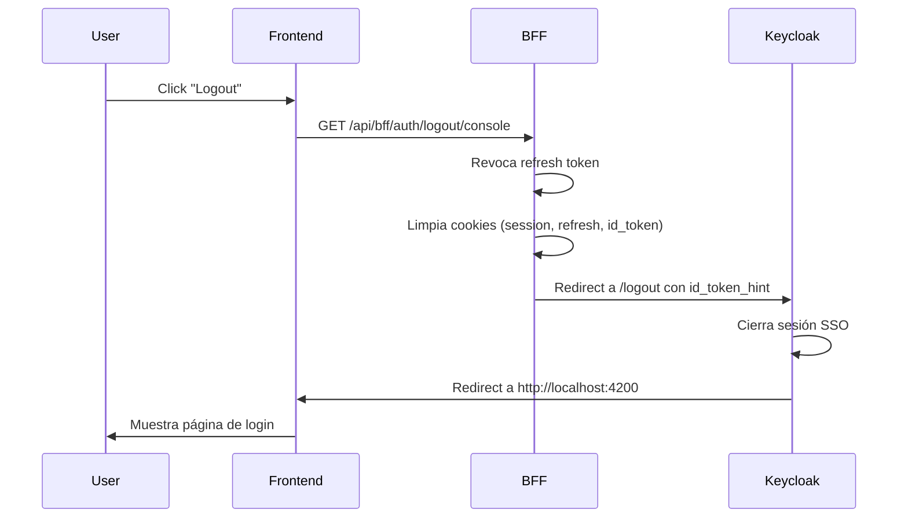

# Configuración de Keycloak para Post Logout Redirect

## Problema

Keycloak muestra el error `Invalid redirect uri` durante el logout porque la URL de redirección post-logout no está registrada en la configuración del cliente.

## Solución Rápida (Manual)

### 1. Accede a Keycloak Admin Console

```
http://localhost:8080/admin
Usuario: admin
Contraseña: admin123
```

### 2. Configura el Cliente Console

1. Selecciona el realm **`guiders`**
2. Ve a **Clients** en el menú lateral
3. Busca y selecciona el cliente **`console`**
4. En la pestaña **Settings**:

#### Valid Redirect URIs
Agrega (si no existe):
```
http://localhost:3000/api/bff/auth/callback/console
http://localhost:4200/*
```

#### Valid Post Logout Redirect URIs
Agrega:
```
http://localhost:4200/*
http://localhost:4200/
```

5. Haz clic en **Save**

### 3. Configura el Cliente Admin (si aplica)

Repite el proceso para el cliente **`admin`**:

#### Valid Redirect URIs
```
http://localhost:3000/api/bff/auth/callback/admin
http://localhost:4201/*
```

#### Valid Post Logout Redirect URIs
```
http://localhost:4201/*
http://localhost:4201/
```

## Solución Automática (Script)

Ejecuta el script de configuración:

```bash
./scripts/configure-keycloak-logout.sh
```

El script configura automáticamente ambos clientes (console y admin).

## Configuración para Producción

En producción, usa URLs específicas en lugar de comodines:

**Cliente Console:**
```
Valid Redirect URIs:
- https://api.guiders.es/api/bff/auth/callback/console
- https://console.guiders.es/
- https://console.guiders.es/auth/callback

Valid Post Logout Redirect URIs:
- https://console.guiders.es/
- https://console.guiders.es/login
```

**Cliente Admin:**
```
Valid Redirect URIs:
- https://api.guiders.es/api/bff/auth/callback/admin
- https://admin.guiders.es/
- https://admin.guiders.es/auth/callback

Valid Post Logout Redirect URIs:
- https://admin.guiders.es/
- https://admin.guiders.es/login
```

## Variables de Entorno Requeridas

Asegúrate de tener configuradas:

```bash
# .env
ALLOW_RETURN_TO=http://localhost:4200,http://localhost:4201
BACKEND_URL=http://localhost:3000
```

En producción:
```bash
ALLOW_RETURN_TO=https://console.guiders.es,https://admin.guiders.es
BACKEND_URL=https://api.guiders.es
```

## Verificación

Después de la configuración:

1. **Login** → Debe funcionar normalmente
2. **Logout** → Debe cerrar sesión y redirigir al frontend
3. **Login nuevamente** → Debe pedir credenciales (no auto-login)

## Flujo Completo de Logout



## Troubleshooting

### Error: "Invalid redirect uri"

**Causa**: La URL no está registrada en `Valid Post Logout Redirect URIs`

**Solución**: 
1. Verifica que la URL en el error coincida con tu configuración
2. Agrega la URL exacta a `Valid Post Logout Redirect URIs` en Keycloak
3. Usa comodines (`*`) solo en desarrollo

### Error: "Missing parameters: id_token_hint"

**Causa**: El id_token no se guardó correctamente en la cookie

**Solución**:
1. Verifica que después del login exista la cookie `console_session_id`
2. Revisa los logs del backend para ver si el id_token está presente
3. Haz login nuevamente para obtener un id_token fresco

### Logout redirige pero no cierra sesión SSO

**Causa**: El id_token_hint no es válido o expiró

**Solución**:
1. Verifica que el id_token no haya expirado
2. Asegúrate de que el id_token se renueva en el refresh
3. Limpia todas las cookies y vuelve a hacer login

## Referencias

- [Keycloak OIDC Logout Documentation](https://www.keycloak.org/docs/latest/securing_apps/#_oidc-logout)
- [OpenID Connect RP-Initiated Logout](https://openid.net/specs/openid-connect-rpinitiated-1_0.html)
