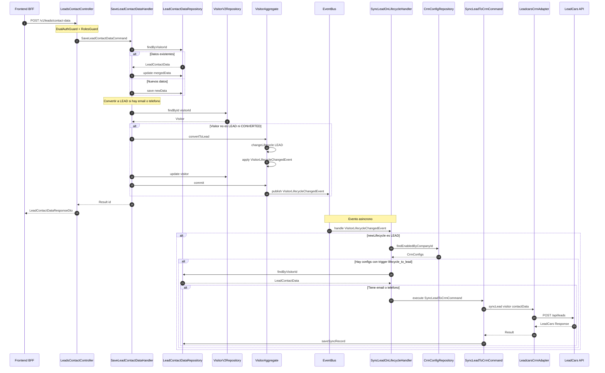

# Integración con LeadCars CRM

## Descripción General

El módulo **Leads** permite sincronizar automáticamente los datos de contacto de visitantes con el CRM **LeadCars** cuando un visitor es convertido a LEAD.

### Métodos de Captura de Leads

| Método | Descripción | Actor |
|--------|-------------|-------|
| **Manual** | Comercial guarda datos via API | `POST /api/v1/leads/contact-data` |
| **Automático (IA)** | LLM extrae datos de la conversación | Tool `save_lead_contact_data` |

Ambos métodos utilizan el mismo flujo interno: guardan los datos, convierten el visitor a LEAD, y disparan la sincronización con LeadCars.

## Arquitectura

### Diagrama de Secuencia



[Ver diagrama interactivo](https://mermaidchart.com/play?utm_source=mermaid_mcp_server&utm_medium=remote_server&utm_campaign=claude#pako:eNqNVE1v2zAM_StErltRbEcfCjiOsgTI2sIJjB4KFKrNOAJkyZPkbMGw_z7K30mcoj40dvUovkc-8u8s1RnOgpnFXxWqFBeC54YXrwro4ZXTqire0TTfJTdOpKLkysGSAbewNFo5VBnMl8trTPi89qAN8sxGBOSp8z9GSzl1ZfRz4eFbfkQf0kYsuOMrrrLJkE3cJRihYyy1FU6b03VAUgckoj5Pvn8IDUfQMM8N5tzhNY7NPY4dUbl5ZSfOV7Wqk0o9zye1EXtMT6nEm6qimmRkChK1F_lHJLfR-PKdroOKgm6eKFbUFSvlxhIyzHjppgiwl11fV4L6Rr6qBrZkdw8P9B3A89N2B_fHb_fS9_c-bRpwl1EHGuijdgj6iAZq_KLiMqzc4UfFTQZfINYSbf3RwAlEV5MJgikLnKlq_hKUAjZxAHuhsvmpbdW6BXHpgCK1BfwjLLnUYdsd_2ziuy7bRaYBMySoSpKFUKDJMRtAKC3CY4VHSpL5VFOxlsSAwt-jsHMdQ51qOkSF3p0wwGHDwgVYAQd-Aiy4kKDBocS9VnpchKQvwjqD43kdkkFpW6Fxcl-l9t-gNKBtcioB0dNjwuIdW1yKSsIA0obkTvviDYAk7M4PXOXYW72-dALGy1Keuvw9OqqDs3qkrpIP3TiO1VzSKwrhLhKyeQBl9S6FPXwiJV6brXN-jLaisomRceloyYLrTWRLrSwunO7mZ2g2m39lq6BZHJrGTajU9G1lc0-Yjg_1kvgE36Gd5LWh8G1Dh1KwlXdD6xem-LtEsg2NF03-aT3qZVT7xnPoN9HI38ObT7kif6YNxP-CMyLPSaPseLw5_SbPrNJzuTnA56Pqidyc1HNGHaudQIU35uaKxjYKaFFgWlF_bu_T8bONPHsKsy28cySktzjWcnwYbdhug_JSNCt0gtjL7q7N0e_izlOTF7c6GoPeYtzuJC8yxlSbC2k41tp_1C-zf_8B2WeJdQ)

### Componentes Principales

| Componente | Ubicación | Responsabilidad |
|------------|-----------|-----------------|
| `LeadsContactController` | `infrastructure/controllers/` | Endpoints para datos de contacto |
| `LeadsAdminController` | `infrastructure/controllers/` | Endpoints de administración CRM |
| `SaveLeadContactDataCommandHandler` | `application/commands/` | Guarda datos y convierte a LEAD |
| `SyncLeadOnLifecycleChangedEventHandler` | `application/events/` | Escucha cambio de lifecycle y sincroniza |
| `SyncLeadToCrmCommandHandler` | `application/commands/` | Ejecuta sincronización con CRM |
| `LeadcarsCrmSyncAdapter` | `infrastructure/adapters/` | Adaptador específico para LeadCars API |
| `CrmSyncServiceFactory` | `infrastructure/services/` | Factory para obtener adaptadores CRM |

---

## Flujo de Sincronización

### 1. Guardado de Datos de Contacto (Manual)

Cuando un **comercial** o **admin** guarda datos de contacto de un visitor:

1. Se envía `POST /api/v1/leads/contact-data` con los datos
2. El `SaveLeadContactDataCommandHandler`:
   - Guarda/actualiza los datos de contacto en MongoDB
   - Si hay email o teléfono, convierte el visitor a LEAD
   - El cambio de lifecycle emite `VisitorLifecycleChangedEvent`

### 1b. Guardado de Datos de Contacto (Automático por IA)

Cuando la **IA** detecta datos de contacto durante una conversación:

1. El visitante escribe algo como: *"Me llamo Juan, mi email es juan@email.com"*
2. El LLM detecta los datos y llama a la tool `save_lead_contact_data`
3. El `ToolExecutorServiceImpl` ejecuta `SaveLeadContactDataCommand` via `CommandBus`
4. El mismo `SaveLeadContactDataCommandHandler` procesa los datos (igual que el flujo manual)
5. El visitante es convertido a LEAD y sincronizado con LeadCars

**Diagrama del flujo IA:**

```
┌─────────────────────────────────────────────────────────────────┐
│  Visitante: "Soy María López, llámame al 612345678"             │
└─────────────────────────────────────────────────────────────────┘
                              │
                              ▼
┌─────────────────────────────────────────────────────────────────┐
│  LLM (Groq) detecta datos de contacto                           │
│  → Invoca tool: save_lead_contact_data                          │
└─────────────────────────────────────────────────────────────────┘
                              │
                              ▼
┌─────────────────────────────────────────────────────────────────┐
│  ToolExecutorServiceImpl.handleSaveLeadContactData()            │
│  → Ejecuta SaveLeadContactDataCommand via CommandBus            │
└─────────────────────────────────────────────────────────────────┘
                              │
                              ▼
┌─────────────────────────────────────────────────────────────────┐
│  SaveLeadContactDataCommandHandler:                             │
│  1. Guarda LeadContactData en MongoDB                           │
│  2. Convierte visitor a LEAD (porque tiene teléfono)            │
│  3. Publica VisitorLifecycleChangedEvent                        │
└─────────────────────────────────────────────────────────────────┘
                              │
                              ▼
┌─────────────────────────────────────────────────────────────────┐
│  SyncLeadOnLifecycleChangedEventHandler:                        │
│  → Detecta cambio a LEAD                                        │
│  → Ejecuta SyncLeadToCrmCommand                                 │
└─────────────────────────────────────────────────────────────────┘
                              │
                              ▼
┌─────────────────────────────────────────────────────────────────┐
│  LeadcarsCrmSyncAdapter → POST a LeadCars API                   │
└─────────────────────────────────────────────────────────────────┘
```

**Habilitar la tool de captura automática:**

```bash
curl -X PATCH /v2/llm/config/SITE_ID \
  -H "Authorization: Bearer TOKEN" \
  -H "Content-Type: application/json" \
  -d '{
    "aiAutoResponseEnabled": true,
    "toolConfig": {
      "saveLeadContactEnabled": true
    }
  }'
```

> **Nota**: Ver documentación completa en [LLM_TOOL_USE_GUIDE.md](../LLM_TOOL_USE_GUIDE.md)

### 2. Sincronización Automática con CRM

El `SyncLeadOnLifecycleChangedEventHandler` escucha el evento y:

1. Verifica que el nuevo lifecycle sea `LEAD`
2. Busca configuraciones CRM habilitadas para la empresa
3. Filtra las que tienen `lifecycle_to_lead` en `triggerEvents`
4. Verifica que existan datos de contacto (email o teléfono)
5. Ejecuta `SyncLeadToCrmCommand` para cada CRM configurado

### 3. Envío a LeadCars

El `LeadcarsCrmSyncAdapter`:

1. Construye el payload según la API de LeadCars
2. Envía la petición HTTP al endpoint configurado
3. Registra el resultado en `CrmSyncRecord`

---

## API Endpoints

### Datos de Contacto

#### POST /api/v1/leads/contact-data
Guarda datos de contacto y convierte visitor a LEAD.

**Autenticación**: Bearer Token o Cookie BFF (roles: `admin`, `commercial`)

**Request Body**:
```json
{
  "visitorId": "uuid-del-visitor",
  "nombre": "Juan",
  "apellidos": "García López",
  "email": "juan@ejemplo.com",
  "telefono": "+34612345678",
  "dni": "12345678A",
  "poblacion": "Madrid",
  "additionalData": {
    "vehiculoInteres": "Seat Leon",
    "financiacion": true
  },
  "extractedFromChatId": "uuid-del-chat"
}
```

**Response** (201):
```json
{
  "id": "uuid-del-registro",
  "visitorId": "uuid-del-visitor",
  "companyId": "uuid-de-la-empresa",
  "nombre": "Juan",
  "apellidos": "García López",
  "email": "juan@ejemplo.com",
  "telefono": "+34612345678",
  "dni": "12345678A",
  "poblacion": "Madrid",
  "additionalData": {
    "vehiculoInteres": "Seat Leon",
    "financiacion": true
  },
  "extractedFromChatId": "uuid-del-chat",
  "extractedAt": "2024-01-15T10:30:00.000Z",
  "updatedAt": "2024-01-15T10:30:00.000Z"
}
```

#### GET /api/v1/leads/contact-data/visitor/:visitorId
Obtiene datos de contacto por visitor ID.

**Autenticación**: Bearer Token o Cookie BFF (roles: `admin`, `commercial`)

#### GET /api/v1/leads/contact-data/:id
Obtiene datos de contacto por ID del registro.

**Autenticación**: Bearer Token o Cookie BFF (roles: `admin`, `commercial`)

#### GET /api/v1/leads/contact-data/company/all
Obtiene todos los datos de contacto de la empresa.

**Autenticación**: Bearer Token o Cookie BFF (roles: `admin`)

---

### Administración CRM

#### POST /api/v1/leads/admin/config
Crea configuración de CRM para la empresa.

**Autenticación**: Bearer Token o Cookie BFF (roles: `admin`)

**Request Body**:
```json
{
  "companyId": "uuid-de-la-empresa",
  "crmType": "leadcars",
  "enabled": true,
  "syncChatConversations": false,
  "triggerEvents": ["lifecycle_to_lead", "chat_closed"],
  "config": {
    "apiUrl": "https://api.leadcars.com",
    "apiKey": "tu-api-key-de-leadcars",
    "dealerId": "dealer-123",
    "defaultSource": "web-chat"
  }
}
```

**Response** (201):
```json
{
  "id": "uuid-de-la-config",
  "companyId": "uuid-de-la-empresa",
  "crmType": "leadcars",
  "enabled": true,
  "syncChatConversations": false,
  "triggerEvents": ["lifecycle_to_lead", "chat_closed"],
  "config": {
    "apiUrl": "https://api.leadcars.com",
    "dealerId": "dealer-123",
    "defaultSource": "web-chat"
  },
  "createdAt": "2024-01-15T10:00:00.000Z",
  "updatedAt": "2024-01-15T10:00:00.000Z"
}
```

#### GET /api/v1/leads/admin/config
Obtiene todas las configuraciones CRM de la empresa.

**Autenticación**: Bearer Token o Cookie BFF (roles: `admin`)

#### GET /api/v1/leads/admin/config/:id
Obtiene configuración CRM por ID.

**Autenticación**: Bearer Token o Cookie BFF (roles: `admin`)

#### PUT /api/v1/leads/admin/config/:id
Actualiza configuración CRM.

**Autenticación**: Bearer Token o Cookie BFF (roles: `admin`)

#### DELETE /api/v1/leads/admin/config/:id
Elimina configuración CRM.

**Autenticación**: Bearer Token o Cookie BFF (roles: `admin`)

#### POST /api/v1/leads/admin/test-connection
Prueba la conexión con el CRM.

**Autenticación**: Bearer Token o Cookie BFF (roles: `admin`)

**Request Body**:
```json
{
  "crmType": "leadcars",
  "config": {
    "apiUrl": "https://api.leadcars.com",
    "apiKey": "tu-api-key-de-leadcars",
    "dealerId": "dealer-123"
  }
}
```

**Response**:
```json
{
  "success": true
}
```

o en caso de error:
```json
{
  "success": false,
  "error": "Mensaje de error",
  "validationErrors": ["Error 1", "Error 2"]
}
```

#### GET /api/v1/leads/admin/sync-records
Obtiene registros de sincronización de la empresa.

**Autenticación**: Bearer Token o Cookie BFF (roles: `admin`)

#### GET /api/v1/leads/admin/sync-records/visitor/:visitorId
Obtiene registros de sincronización por visitor.

**Autenticación**: Bearer Token o Cookie BFF (roles: `admin`, `commercial`)

#### GET /api/v1/leads/admin/sync-records/failed
Obtiene sincronizaciones fallidas.

**Autenticación**: Bearer Token o Cookie BFF (roles: `admin`)

#### GET /api/v1/leads/admin/supported-crms
Obtiene lista de CRMs soportados.

**Autenticación**: Bearer Token o Cookie BFF (roles: `admin`)

**Response**:
```json
["leadcars"]
```

---

## Configuración LeadCars

### Campos de Configuración

| Campo | Tipo | Requerido | Descripción |
|-------|------|-----------|-------------|
| `apiUrl` | string | Sí | URL base de la API de LeadCars |
| `apiKey` | string | Sí | API Key proporcionada por LeadCars |
| `dealerId` | string | Sí | ID del concesionario en LeadCars |
| `defaultSource` | string | No | Fuente por defecto (ej: "web-chat") |

### Trigger Events

| Evento | Descripción |
|--------|-------------|
| `lifecycle_to_lead` | Se dispara cuando un visitor cambia a LEAD |
| `chat_closed` | Se dispara cuando se cierra un chat (si `syncChatConversations: true`) |

---

## Ciclo de Vida del Visitor

```
ANON → ENGAGED → LEAD → CONVERTED
```

| Estado | Descripción | Dispara Sync |
|--------|-------------|--------------|
| `ANON` | Visitante anónimo sin identificar | No |
| `ENGAGED` | Visitante que ha interactuado | No |
| `LEAD` | Visitante con datos de contacto | **Sí** |
| `CONVERTED` | Cliente convertido | No |

### Conversión Automática a LEAD

Un visitor se convierte automáticamente a LEAD cuando:

1. Un **comercial** guarda datos de contacto (`POST /contact-data`)
2. La **IA** extrae y guarda datos de contacto (tool `save_lead_contact_data`)
3. Los datos incluyen **email** o **teléfono**
4. El visitor actual NO es ya `LEAD` o `CONVERTED`

---

## Modelo de Datos

### LeadContactData (MongoDB)

```typescript
{
  id: string;              // UUID
  visitorId: string;       // UUID del visitor
  companyId: string;       // UUID de la empresa (tenantId)
  nombre?: string;
  apellidos?: string;
  email?: string;
  telefono?: string;
  dni?: string;
  poblacion?: string;
  additionalData?: Record<string, unknown>;
  extractedFromChatId?: string;
  extractedAt: Date;
  updatedAt: Date;
}
```

### CrmCompanyConfig (MongoDB)

```typescript
{
  id: string;
  companyId: string;
  crmType: string;           // "leadcars"
  enabled: boolean;
  syncChatConversations: boolean;
  triggerEvents: string[];   // ["lifecycle_to_lead"]
  config: {
    apiUrl: string;
    apiKey: string;          // Encriptado en BD
    dealerId: string;
    defaultSource?: string;
  };
  createdAt: Date;
  updatedAt: Date;
}
```

### CrmSyncRecord (MongoDB)

```typescript
{
  id: string;
  visitorId: string;
  companyId: string;
  crmType: string;
  crmConfigId: string;
  status: "pending" | "success" | "failed";
  externalId?: string;       // ID en el CRM externo
  requestPayload: object;
  responsePayload?: object;
  errorMessage?: string;
  syncedAt: Date;
  retryCount: number;
}
```

---

## Manejo de Errores

### Errores de Validación

Si la configuración del CRM es inválida:
```json
{
  "statusCode": 400,
  "message": "Configuración inválida: apiUrl es requerido, apiKey es requerido"
}
```

### Errores de Sincronización

Los errores de sincronización NO fallan la operación principal. Se registran en `CrmSyncRecord` con:
- `status: "failed"`
- `errorMessage`: Detalle del error
- `retryCount`: Número de reintentos

---

## Archivos Clave

```
src/context/leads/
├── application/
│   ├── commands/
│   │   ├── save-lead-contact-data.command.ts
│   │   ├── save-lead-contact-data-command.handler.ts
│   │   ├── sync-lead-to-crm.command.ts
│   │   └── sync-lead-to-crm-command.handler.ts
│   ├── events/
│   │   └── sync-lead-on-lifecycle-changed.event-handler.ts
│   └── dtos/
│       ├── lead-contact-data.dto.ts
│       └── crm-config.dto.ts
├── domain/
│   ├── lead-contact-data.repository.ts
│   ├── crm-company-config.repository.ts
│   ├── crm-sync-record.repository.ts
│   └── services/
│       └── crm-sync.service.ts
├── infrastructure/
│   ├── controllers/
│   │   ├── leads-contact.controller.ts
│   │   └── leads-admin.controller.ts
│   ├── adapters/
│   │   └── leadcars/
│   │       ├── leadcars-api.service.ts
│   │       └── leadcars-crm-sync.adapter.ts
│   ├── persistence/
│   │   ├── schemas/
│   │   └── impl/
│   └── services/
│       └── crm-sync-service.factory.ts
└── leads.module.ts

src/context/llm/infrastructure/services/
└── tool-executor.service.impl.ts  # Handler de save_lead_contact_data (IA)
```

---

## Extensibilidad

### Agregar Nuevo CRM

1. Crear adaptador en `infrastructure/adapters/<nuevo-crm>/`
2. Implementar interface `ICrmSyncAdapter`
3. Registrar en `CrmSyncServiceFactory`
4. Agregar tipo en `getSupportedCrmTypes()`

### Interface del Adaptador

```typescript
interface ICrmSyncAdapter {
  getCrmType(): string;
  validateConfig(config: CrmCompanyConfigPrimitives): string[];
  testConnection(config: CrmCompanyConfigPrimitives): Promise<Result<boolean, DomainError>>;
  syncLead(
    visitor: VisitorPrimitives,
    contactData: LeadContactDataPrimitives,
    config: CrmCompanyConfigPrimitives,
  ): Promise<Result<CrmSyncResult, DomainError>>;
}
```
