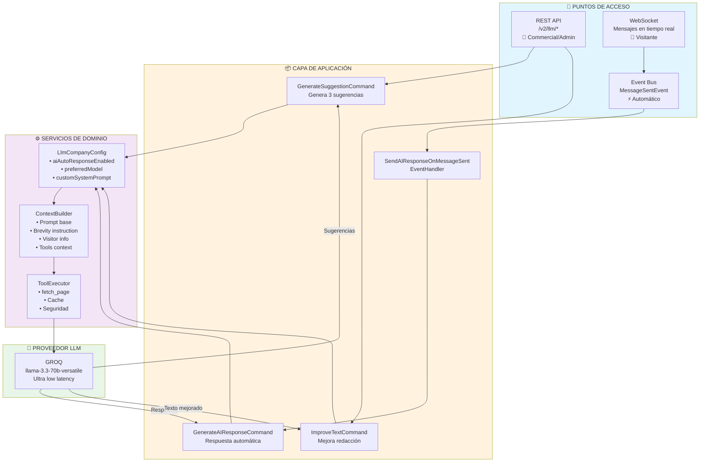
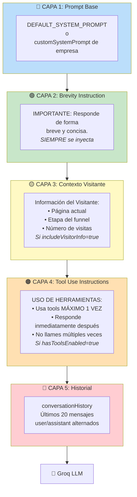
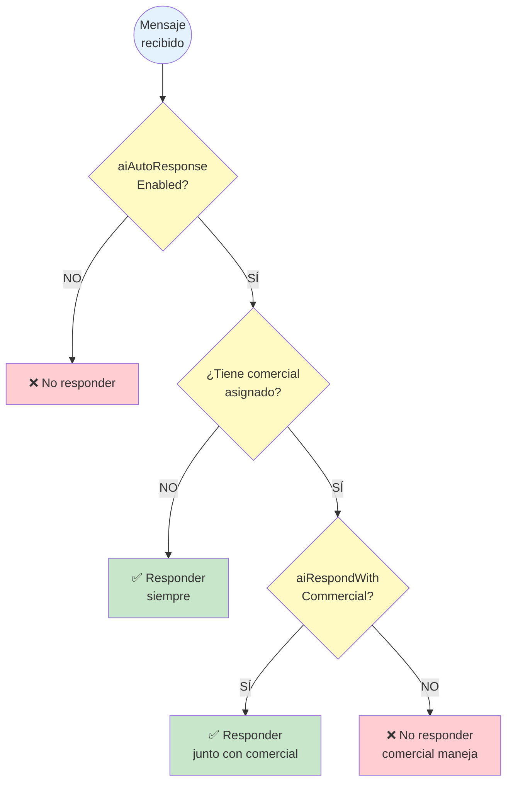
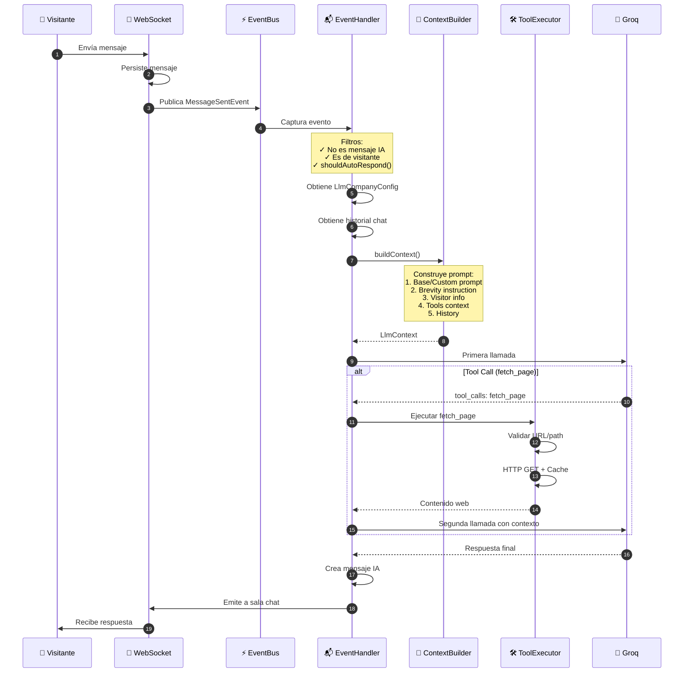
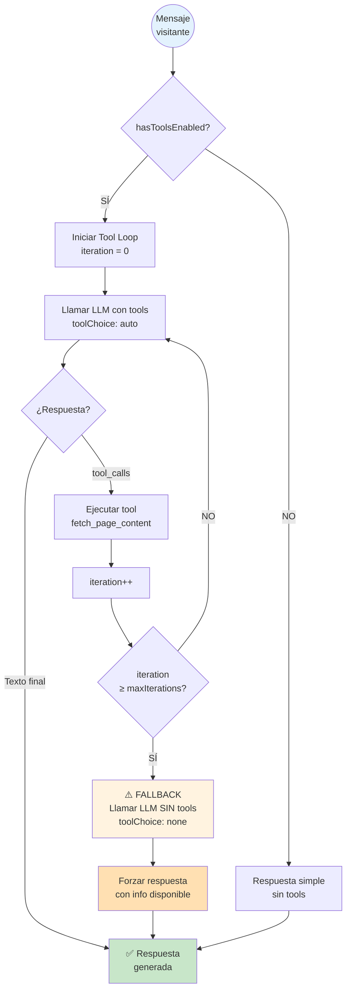

# Arquitectura del Sistema LLM - Guiders Backend

## Vista General



[🎨 Editar en Mermaid Playground](https://mermaidchart.com/play?utm_source=mermaid_mcp_server&utm_medium=remote_server&utm_campaign=claude#pako:eNp9VM1u00AQfpVVuCGF0EQRUKFKrmOKpSQ2cUiRCEIbe5wY1rvR7joQUSTeACEkJHqpQMCBKxfufRNegD4Cu-uf2qGqL_Z-M_PN-JvZedMKWQSt_VZM2KtwhblE08M5ReoR2WLJ8XqFLNt2guDpvHVxdvoT-Y_HUy9AAyfHvXnrWe6vn4kTTJWjfiHLd-8veOegs-l2CEk7N83p4uzDN2SzNAUeJph0rChNaIPjWKc6hkXAwpcgTdAIqMAvQCCgSCaQrhnigElJ-B3NEpFITCU0mJyZM9blOBugEh1moiATAi8hUJgxGPDP6RdkZZKl519kErKKBmg0p7t6-L4R4-MPZFu-ZaTwh65t2e75x3GjAns02FO-R0CBYwlBtlyCkAmjWgFMI5M7t6KeyrAEDlTpInZZuorFTdecbWAKr2U9fAQvmArnEOEwTM5_0d3YXq0Cy52AWDMqoE6hsUwVhhGuNMANmofWeDB0JopJ6RZdsni0JqfhMpo-VMwE-LUyBs5k5qoJUpx_Tj___f2-QNx8ugbeyB27zfGyvfED90gFDEmq6l9jurUZjZNl3sN3XxFOdBfL6hyKFwSiyrrmEANXSo3U0JMKDjOh_jrYCgmpzxWv3M06dZ7oQVLJpFL_MEtIBLyKz2PQAguosEMOm0RuUUKF5Fmoe17ZzLQyrmwxq8ApY0SgMM_QyD_1vKFWSXs4ryFUP3iZOwYZrp6vVQcqyMbh6vIUwDLjSYSja5vhT7yZOzANvjj79smcHWfgTdBwOGpUczTxHumBUi-TgxCc4nbvVq995_aivQEusExInv8xkWoy1WZBRM0eDbdX1WCWRbt9YC7L_1A3h44DA5grnSPm04DFcOZwcSjDe2UazZ6DZogqsHsV2GuABWxOpUFPRIXrgzGYVuWw-TSglqok0d8aPFFLsrx089ZJUemOR1DfByc1fWo-ehswlJodELHCrVv1V24JFAscxQkh-zdgL-7H0DD7fmGL47gHt-u28pKWDj3ox_26Qzk4JfvduA_3Wm__AQ96DMA)

---

## 1. Puntos de Entrada a la IA

### REST Endpoints

| Endpoint | Método | Roles | Descripción |
|----------|--------|-------|-------------|
| `/v2/llm/suggestions` | POST | commercial, admin | Genera 3 sugerencias de respuesta |
| `/v2/llm/improve` | POST | commercial, admin | Mejora redacción de texto |
| `/v2/llm/config/:companyId` | GET | admin | Obtiene configuración LLM |
| `/v2/llm/config` | POST | admin | Crea configuración |
| `/v2/llm/config/:companyId` | PATCH | admin | Actualiza configuración |
| `/v2/llm/config/providers` | GET | admin | Lista proveedores disponibles |

### Event-Driven (Automático)

El sistema responde automáticamente a mensajes de visitantes mediante eventos:

1. Visitante envía mensaje via WebSocket
2. Se publica `MessageSentEvent`
3. `SendAIResponseOnMessageSentEventHandler` captura el evento
4. Aplica filtros (no es IA, es visitante, shouldAutoRespond = true)
5. Ejecuta `GenerateAIResponseCommand`

---

## 2. Capas de Prompts

El system prompt se construye en **5 capas**, cada una añadiendo información:



[🎨 Editar en Mermaid Playground](https://mermaidchart.com/play?utm_source=mermaid_mcp_server&utm_medium=remote_server&utm_campaign=claude#pako:eNqVk99u0zAUxl_lqFyPbf2DWDQqpVtgkZq2StKKQdHkOM5m5NjFdjoqhATvgLjgZmzihmvgZrd5E56AR8BJStqqk4CoqpLv87F_37H9poFFTBpWI2HiEl8gqSHsTTmYR2XRuUSzC-jbp46__3za-HX14Qcc2SMb9i0YSZHONPSQItPGi6qkeHp24Jixx85je9wPz4LTIHS8s5E_9EbhYSR3u6L8x5nSIg0WSpN0OVVMgKQzSRSqJyQ8nvK7cJolztVNhdO0oCfJnOoFuFxpmWFNBd_E8p2JG56aMtcbDf3QHoSOBT5RM8HNwuaXCJmiki0ycxFYABYcU4Xul-Ih7Qau4418BxQByhcEa3S4S7t_h21VsNcVbMuCI8E1ea0FTKiiGpmPDdaJG7jh0C9YeUmFaf6NG0a2KrBKqJ_vbmCUX59TjgBhnSFWy45GM1TWJBnnZGUM8tuUSFFEnpezqTofNbkwy2JSLiNksfwj007ybznbVc7PVc62BaEQDMamXWu7ojaihsNh3x0EoakcB0M4duDE8X3bc51BaAerkGOFQJvZFHj5-6euN4R9mDjPar_eSMpTElOkUUpMl0xINcvyr2qVXgBjxlSQ5rdM0xkzr3OCyXoXLpAq0JXDUcRI_B8t6FTX5HvVgo4FJ9Scc0kR24h94gZmg4vTaM7YnEiFitZUYxclSP7JwKVCQXMPTBSFXi4JM0XkLlLKjDXnABDTRHIUC3UXXHV1YWenu7w2a3JzJbfW5NZKbq_J7ZXcWZM7ldz3ytxfPsITKV4V3yXNskN6wcgflIQyZt2Lopgk0ZbdXNr4IXmAD7bs1tJOkuQAt7fsdm2Tvai5ZXdqG8dxs_H2N9gxpY4)

### Descripción de cada capa

| Capa | Nombre | Condición | Contenido |
|------|--------|-----------|-----------|
| 1 | Prompt Base | Siempre | `DEFAULT_SYSTEM_PROMPT` o `customSystemPrompt` de la empresa |
| 2 | Brevity | **Siempre** | "IMPORTANTE: Responde de forma breve y concisa" |
| 3 | Visitante | `includeVisitorInfo=true` | Página actual, etapa, visitas |
| 4 | Tool Use Instructions | `hasToolsEnabled=true` | Instrucciones para limitar uso de tools a 1 vez |
| 5 | Historial | Siempre | Últimos 20 mensajes de la conversación |

---

## 3. Configuración por Empresa (LlmCompanyConfig)

```typescript
interface LlmCompanyConfig {
  // Control de Features
  aiAutoResponseEnabled: boolean;     // Responder automáticamente
  aiSuggestionsEnabled: boolean;      // Mostrar sugerencias a comerciales
  aiRespondWithCommercial: boolean;   // Responder si hay comercial asignado

  // Modelo y Proveedor
  preferredProvider: "groq";
  preferredModel: "llama-3.3-70b-versatile";

  // Personalización
  customSystemPrompt?: string;        // Prompt personalizado (opcional)

  // Parámetros de Generación
  maxResponseTokens: 500;
  temperature: 0.7;
  responseDelayMs: 1000;

  // Configuración de Tools
  toolConfig: {
    fetchPageEnabled: boolean;
    allowedPaths: string[];           // Rutas permitidas
    maxIterations: 3;
    cacheEnabled: true;
    cacheTtlSeconds: 3600;
  };
}
```

### Lógica de Decisión: shouldAutoRespond()



[🎨 Editar en Mermaid Playground](https://mermaidchart.com/play?utm_source=mermaid_mcp_server&utm_medium=remote_server&utm_campaign=claude#pako:eNp1kcFOgzAYx1-lwct2WAyFGLeYmUU9OgMj8TA5lParK4F2KSzGwI7e9A30WUzmm-xJRECxU3ro5ff__b-vUFhUMbAmFk_UA10RnaPg8k6i6iyCmR8MBtcgMxLDWaSPpxqoiARTwyEajabIswsiZptc-ZCtlcya0JUkUQLsfNvUNLdnfxnl_KZEvr3cvz2juUK61hjo0AgtPl5K5OFi9x4IkICoSkFTQZK6nmTiXhKmDvpx14-X-9cn5H-X11YmIF1rCI10M8ipHtGGb0W-quMXKm1nHoxxOtF3_pkTb2Suqo1lt3VoqPWG7p8vUMs_CkqJhJhUZuNm-WMCzQ9BXCTJ5Agcjjn7TX27RZxTxrCBcIvoKZzQsYGcfuT2FnrdLD6mroFwP3IMZG0_AQTm0Pg)

---

## 4. Sistema de Tools (Function Calling)

### Tool: fetch_page

| Propiedad | Descripción |
|-----------|-------------|
| **Propósito** | Obtener contenido de páginas web del sitio de la empresa |
| **Parámetro** | `path`: Ruta relativa de la página (ej: `/pricing`) |
| **Seguridad** | Solo dominios de la empresa (whitelist) |
| **Cache** | Configurable, default 1 hora |
| **Timeout** | 10 segundos |

### Flujo de Tool Use



[🎨 Editar en Mermaid Playground](https://mermaidchart.com/play?utm_source=mermaid_mcp_server&utm_medium=remote_server&utm_campaign=claude#pako:eNp1k89u00AQxl9llFMRair-XSJUqTamQUqhakxyqVSN7UmyZb2b7q5Do4o3QEKoiAMgARKIC9y58yZ9AXgExms7TanxIVL2-3lnvm_GZ51UZ9TpdSydFKRSeiBwajA_VMAPFk6rIk_IVP_naJxIxRyVgxGghT8fX3-FkbDC8RFdh8bDinrzEsaUDHX6jNx1KgpK6uLdZ4gWpFxQ2BamX910_r2C-qgy2dZXGNQlv0GoualTvk_IrA2Nowp9_-n3z1cQay2jU0rZcws7GOxV8Je3sGv0yaGqmNHm9vZ42INILX79QMhJWTyukxgPa3GfjBXWUYscBSwXiRQpwh5Zi1Masj3vsakRBSXY70GIc1cYBCpVXYnV72PNt-sFGSi5h0I6o23vfmK2ti8-nLMMZJvq8GhnJUQWMoJFM8HVuZ3pQmY7nMUB2blW2caNVTf9upsniROkCAYyD3XOKS058ImY_gebcQLaCJSQztCtN-_RkINIyknVUysLtvkrOUasM8WSYG64squM3upCgJa2woIL5bXkldusGFoItwTh30yd0MpLd7rV_mrD0kT7s7tdvwwW0qoVf3ivC33vYNkEEQabtUWfgEevhMQ7w8M1IieemZSYY4YNgNL5IjxTKWFjQi6dHc15-rXt8uH3mwqO0aOUUduDS_YS9fXiiPfwuNxgNK1UHNXUCKXIGHp6MNiao5u1IP043ofdKIab3GI6u3pLs4-laSUyDc8p-acZb35I00JlK_NloE2o9fqSyppI1uyWS1eQdQgToVBeW73QEK6t85rqv8Vc8LYgWJS4tmz-exuVl6ciITBNjc6Lv9mnqFQ)

### Control de Tool Use y Mecanismo de Fallback

Para evitar loops infinitos de tool calling, el sistema implementa:

1. **Instrucciones de Límite**: El system prompt incluye instrucciones para usar tools MÁXIMO 1 vez por pregunta
2. **maxIterations**: Límite configurado (default: 3) en `toolConfig`
3. **Fallback**: Cuando se alcanza `maxIterations`, se fuerza respuesta sin tools



[🎨 Editar en Mermaid Playground](https://mermaidchart.com/play?utm_source=mermaid_mcp_server&utm_medium=remote_server&utm_campaign=claude#pako:eNp1U8tu00AU_ZWR2bSqKqJWQhBBUTCOsDpJqtiVKmEUTcbXzVSTGcszgZakSxYsEHvEgg3_wA4J_qQ_wC8wj2SII-qFZc2559x77hkvIypLiLpRxeU7OiONRvnLQiDzZHlvnO_tDUAocgVPp83Dk7dMMU2Ehv19dHh4guJXSXy6nBGVS8lVIsiUQ_n81vP925XY4tVwtEJZOjjDyesiGoOqF6A0QYrNa-7lFRNIW6UierPLzn5_WiE8Gp0ZcioYZaRBtivCUtaOzTQ0RDMp0DPUCQr-bYl-4h7GRgFzMjcCGA8QleumTsR-xTPJKHQRWWj5bxJDdArjJDvH-fLXz2ChbdjjbuYiyuFaS1QxQXgRGfvncZxkmRng7usHFARc50sQZv6ShI4tITvXhBJud7NCyUUSG5HkCuhCGx8WdSIVaDqb1OQSJsaXBqF3FmGZzkY6tAphZwcHodAgrmLQu_D5hiLX4u7jdzQn1-nmULXtb1ghcru4_0Auz77BXvTiU7uQL9_-_PgcTlyrrZSydHhPSkIK2DG5EXE2-qNxbG9cXzbvjVjTWroNn4lKopKpWgpm7m_QckQnsY5tu4W_yPehSt9w8D-QCZ_z7gM4ro6qsoV62hqnj-ERfbKNBxO-oKqqY-i0Ctx8GxQ606Po9i816jJz)

---

## 5. Proveedor LLM: Groq

### Modelos Disponibles

| Modelo | Parámetros | Uso Recomendado |
|--------|------------|-----------------|
| `llama-3.3-70b-versatile` (DEFAULT) | 70B | General |
| `llama-3.1-8b-instant` | 8B | Respuestas rápidas |
| `meta-llama/llama-4-scout-17b` | 17B | Equilibrado |
| `meta-llama/llama-4-maverick-17b` | 17B | Tareas complejas |
| `qwen/qwen3-32b` | 32B | Razonamiento |
| `moonshotai/kimi-k2-instruct` | - | Instrucciones |

### Características de Groq

- Latencia ultra baja (especialidad de Groq)
- Soporte completo de function calling
- Context window hasta 128k tokens

---

## 6. Estructura de Archivos

```text
src/context/llm/
│
├── domain/
│   ├── services/
│   │   ├── llm-provider.service.ts         # Interface proveedor
│   │   ├── llm-context-builder.service.ts  # Interface contexto
│   │   └── tool-executor.service.ts        # Interface tools
│   │
│   ├── value-objects/
│   │   ├── llm-company-config.ts           # Config por empresa
│   │   ├── llm-context.ts                  # Contexto para LLM
│   │   ├── llm-response.ts                 # Respuesta del LLM
│   │   └── tool-config.ts                  # Config de tools
│   │
│   ├── llm-config.repository.ts            # Interface repositorio
│   └── errors/llm.error.ts                 # Errores de dominio
│
├── application/
│   ├── commands/
│   │   ├── generate-ai-response.command-handler.ts    # Respuesta auto
│   │   ├── generate-suggestion.command-handler.ts     # Sugerencias
│   │   └── improve-text.command-handler.ts            # Mejorar texto
│   │
│   ├── events/
│   │   └── send-ai-response-on-message-sent.event-handler.ts
│   │
│   └── dtos/
│       ├── llm-config.dto.ts
│       └── ai-response.dto.ts
│
├── infrastructure/
│   ├── controllers/
│   │   ├── llm-config.controller.ts        # REST /v2/llm/config/*
│   │   └── llm-suggestions.controller.ts   # REST /v2/llm/suggestions
│   │
│   ├── providers/
│   │   └── groq-llm-provider.service.ts    # Implementación Groq
│   │
│   ├── services/
│   │   ├── llm-context-builder.service.impl.ts
│   │   └── tool-executor.service.impl.ts
│   │
│   └── persistence/
│       └── mongo-llm-config.repository.impl.ts
│
└── llm.module.ts
```

---

## 7. Archivos Clave Modificados (Instructions)

Los siguientes archivos contienen instrucciones que modifican el comportamiento del LLM:

### `llm-context-builder.service.impl.ts` - Brevity Instruction

```typescript
private readonly BREVITY_INSTRUCTION = `

IMPORTANTE: Responde de forma breve y concisa. Tus respuestas deben ser cortas y directas.`;

// En buildContext():
const basePrompt = params.customSystemPrompt || this.DEFAULT_SYSTEM_PROMPT;
const systemPrompt = basePrompt + this.BREVITY_INSTRUCTION;  // SIEMPRE se añade
```

### `generate-ai-response.command-handler.ts` - Tool Use Instruction

```typescript
private readonly TOOL_USE_INSTRUCTION = `

USO DE HERRAMIENTAS:
- Puedes usar la herramienta fetch_page_content para obtener información del sitio web
- Usa la herramienta MÁXIMO UNA VEZ por pregunta del usuario
- Después de obtener información con la herramienta, DEBES responder inmediatamente al usuario
- NO llames a la herramienta múltiples veces - usa la información que ya obtuviste
- Si la información obtenida no es suficiente, responde con lo que tienes y sugiere que el usuario pregunte algo más específico`;

// En generateWithTools():
const enrichedSystemPrompt = systemPrompt + this.TOOL_USE_INSTRUCTION;
```

### `generate-ai-response.command-handler.ts` - Fallback Mechanism

```typescript
// Cuando se alcanza maxIterations, se fuerza respuesta sin tools:
const finalResult = await this.llmProvider.generateCompletionWithTools({
  systemPrompt: enrichedSystemPrompt +
    '\n\nIMPORTANTE: Ya has consultado suficiente información. Ahora DEBES responder al usuario con la información que tienes disponible. NO solicites más información.',
  messages,
  maxTokens: config.maxResponseTokens,
  temperature: config.temperature,
  tools: [],           // Sin tools para forzar respuesta de texto
  toolChoice: 'none',  // Forzar respuesta sin tool calls
});
```

### `generate-suggestion.command-handler.ts` - Brevity Instruction

```typescript
private readonly BREVITY_INSTRUCTION = `

IMPORTANTE: Responde de forma breve y concisa.`;

// En buildSuggestionsPrompt():
const promptWithBrevity = basePrompt + this.BREVITY_INSTRUCTION;
```

---

## 8. Referencias

- **Contexto LLM**: `src/context/llm/`
- **Event Handler**: `src/context/llm/application/events/send-ai-response-on-message-sent.event-handler.ts`
- **Context Builder**: `src/context/llm/infrastructure/services/llm-context-builder.service.impl.ts`
- **Groq Provider**: `src/context/llm/infrastructure/providers/groq-llm-provider.service.ts`
